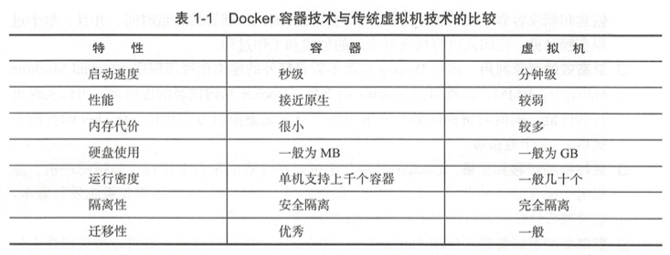
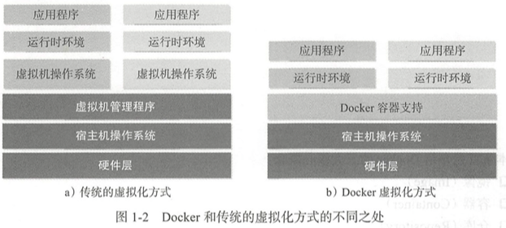

# 第1章 初识Docker与容器

虚拟化既可以通过硬件模拟来实现,也可以通过OS软件来实现.而容器技术则更为优雅,它充分利用了OS本身以后的机制和特性,可以实现远超传统虚拟机的轻量级虚拟化.

## 1.1 什么是Docker

##### 1. Docker开源项目背景

Docker的构想:实现"Build,Ship and Run Any APP,Anywhere".即通过对应用的封装(Packaging)、分发(Distribution)、部署(Deployment)、运行(Runtime)生命周期进行管理,达到应用组件级别的"一次封装,到处运行".这里的应用组件,既可以是一个Web应用、一个编译环境,也可以是一套数据平台服务,甚至是一个OS或集群.

##### 2. Linux容器技术--巨人的肩膀

Linux容器(Linux Containers, LXC):容器有效地将由单个OS管理的资源划分到孤立的组中,以更好地在孤立的组之间平衡有冲突的资源使用需求.与虚拟化相比,这样既不需要指令级模拟,也不需要即时编译.容器可以在核心CPU本地运行指令,而不需任何专门的解释机制.此外,也避免了准虚拟化(para-virtualization)和系统调用替换中的复杂性.

最早的容器技术可以追溯到1982年Unix系列OS上的`chroot`工具(网上大概搜了一下,也是个做虚拟化的工具,其作用是指定根目录(之后的操作和原来的系统是完全隔离开来的).通常用于引导Linux系统启动以及急救系统等).

后来,LXC项目借鉴了前人成熟的容器设计理念,并基于一系列新引入的内核特性,实现了更具扩展性的虚拟化容器方案.更加关键的是,LXC被集成到了主流Linux内核中,成为Linux系统轻量级容器技术的事实标准.从技术层面来看,LXC已经趟过了绝大部分的"坑",完成了容器技术实用化的大半历程.

##### 3. 从Linux到Docker

在LXC的基础上,Docker进一步优化了容器的使用体验.

1. Docker提供了各种容器管理工具(如分发、版本、移植等),让用户无需关注底层操作,更加简单明了地管理和使用容器;
2. Docker通过引入分层文件系统,构建高效的镜像机制,降低了迁移难度

早期的Docker代码实现是基于LXC的.从0.9版本开始,Docker开发了libcontainer项目作为更广泛的容器驱动实现,从而替换掉了LXC的实现.

简单来讲,我们可以将Docker容器理解为一种轻量级的沙盒(sandbox).每个容器内运行着一个应用,不同容器相互隔离,容器之间可以通过网络互相通信.容器的创建和停止十分快速,几乎跟创建和终止原生应用一致;另外,容器自身对系统资源的额外需求也十分有限,远远低于虚拟机.很多时候甚至直接把容器当做应用本身也没有问题.

## 1.2 为什么要使用Docker

##### 1. Docker容器虚拟化的好处

Docker在正确的地点、正确的时间顺应了正确的趋势--如何正确地构建应用

在云时代,开发者创建的应用必须要能很方便地在网络上传播,也就是说应用必须脱离底层物理硬件的限制;同时必须是"任何时间任何地点"可获取的.因此,开发者们需要一种新型的**创建分布式应用程序**的方式,快速分发和部署,而这正是Docker所能够提供的最大优势.

以LNMP为例.按照传统做法:

- step1. 安装Apache、MySQL和PHP以及它们各自运行所依赖的环境
- step2. 分别对它们进行配置(包括创建合适的用户、配置参数等)
- step3. 进行功能测试,看是否工作正常
	- 如果不正常,则需进行调试追踪

更为可怕的是,一旦需要服务器迁移(例如从亚马逊云迁移到其他云),往往需要对每个应用都进行重新部署和调试.这些琐碎而无趣的"体力活",极大地降低了用户的工作效率.**究其根源,是这些应用直接运行在底层操作系统上,无法保证同一份应用在不同的环境中行为一致.**

而Docker提供了一种更为聪明的方式.**通过容器来打包应用、解藕应用和运行平台.**这意味着迁移的时候,只需要在新的服务器上启动需要的容器就可以了,无论新旧服务器是否是同一类型的平台.这无疑将帮助我们节约大量的宝贵时间,并降低部署过程出现问题的风险.

##### 2. Docker在开发和运维中的优势

对开发和运维(DevOps)人员来说,最好的结果肯定是**1次创建或配置,之后可在任何地方、任意时间让应用正常运行.**而Docker恰恰是可以实现这一目标的工具.在开发和运维过程中,Docker具有如下几个方面的优势:

- 更快速的部署和交付
	
	- 于开发人员而言,Docker可以使用镜像来快速构建一套标准的开发环境
	- 于测试和运维人员而言,Docker可以直接使用完全相同(和开发环境相同)的环境来部署代码
	- 以上二者的结果:只要是测试过的代码,就可以确保在生产环境无缝运行
	- Docker 可以快速创建和删除容器,实现快速迭代,节约开发、测试、部署的大量时间.并且,整个过程全程可见,使团队更容易理解应用的创建和工作过程.

- 更高效的资源利用
	
	- 运行Docker容器不需要额外的虚拟化管理程序(Virtual Machine Manager, VMM, 以及Hypervisor)的支持,**Docker是内核级的虚拟化,可以实现更高的性能,同时对资源的额外需求很低.**与传统虚拟机方式相比,Docker的性能要提高1-2个数量级

- 更轻松的迁移和扩展
	- Docker容器几乎可以在任意的平台上运行,包括物理机、虚
拟机、公有云、私有云、个人电脑、服务器等,同时支持主流的操作系统发行版本.这种兼容性让用户可以在不同平台之间轻松地迁移应用.

- 更简单的更新管理
	- 使用Dockerfile,只需小小的配置修改,就可以替代以往大量的更新工作.**所有修改都以增量的方式被分发和更新,从而实现自动化并且高效的容器管理.**

##### 3. Docker与虚拟机比较

作为一种轻量级的虚拟化方式,Docker在运行应用上跟传统的虚拟机方式相比具有如下显著优势:

- Docker容器很快,启动和停止可以在秒级实现,这相比传统的虚拟机方式(数分钟)要快得多
- Docker容器对系统资源需求很少,一台主机上可以同时运行数千个 Docker容器
- Docker通过类似Git设计理念的操作来方便用户获取、分发和更新应用镜像,存储复用,增量更新
- Docker通过Dockerfile支持灵活的自动化创建和部署机制,以提高工作效率,并标准化流程

Docker容器除了运行其中的应用外,基本不消耗额外的系统资源,在保证应用性能的同时,尽量减小系统开销.传统虚拟机方式运行N个不同的应用就要启用N个虚拟机(每个虚拟机需要单独分配独占的内存、磁盘等资源),而 Docker只需要启动N个隔离得"很薄的"容器,并将应用放进容器内即可.应用获得的是接近原生的运行性能.

在隔离性方面,传统的虚拟机方式提供的是相对封闭的隔离.但这并不意味着Docker不安全.Docker利用Linux系统上的多种防护技术实现了严格的隔离可靠性,并且可以整合众多安全工具.从1.3.0版本开始,Docker重点改善了容器的安全控制和镜像的安全机制,极大地提高了使用Docker 的安全性.在已知的大规模应用中,目前尚未出现值得担忧的安全隐患.

## 1.3 Docker与虚拟化

虚拟化(virtualization)技术是一个通用的概念,在不同领域有不同的理解.在计算领域,一般指的是计算虚拟化(computingvirtualization),或通常说的服务器虚拟化.维基百科上的定义如下:

"在计算机技术中,虚拟化是一种资源管理技术,是将计算机的各种实体资 源,如服务器、网络、内存及存储等,予以抽象、转换后呈现出来,打破实体结构间的不可切割的障碍,使用户可以用比原本的组态更好的方式来应用这些资源."

**虚拟化的核心是对资源的抽象,目标往往是为了在同一个主机上同时运行多个系统或应用,从而提高系统资源的利用率,并且带来降低成本、方便管理和容错容灾等好处.**

基于软件的虚拟化根据目标所在的层次,又可以分为应用虚拟化和平台虚拟化(通常说的虚拟机技术即属于这个范畴).应用虚拟化一般指的是一些模拟设备或诸如Wine这样的软件.平台虚拟化又可以细分为几个子类:

- 完全虚拟化
	
	虚拟机模拟完整的底层硬件环境和特权指令的执行过程,客户操作系
统无须进行修改.例如IBM的p和z系列的虚拟化、VMware Workstation、VirtualBox、QEMU等

- 硬件辅助虚拟化

	利用硬件(主要是CPU)辅助支持(目前x86体系结构上可用的硬
件辅助虚拟化技术包括Intel-VT和AMD-V)处理敏感指令来实现完全虚拟化的功能,客户操作系统无须修改,例如VMware Workstation,Xen,KVM

- 超虚拟化(paravirtualization)

	部分硬件接口以软件的形式提供给客户机操作系统,客户操作系统需要进行修改.例如早期的Xen

- 操作系统级虚拟化

	内核通过创建多个虚拟的操作系统实例(内核和库)来隔离不同的进程.容器相关技术即在这个范畴
	
**Docker以及其他容器技术都属于操作系统虚拟化这个范畴.**操作系统虚拟化最大的特点就是不需要额外的supervisor支持.Docker虚拟化方式之所以有众多优势,跟操作系统虚拟化技术自身的设计和实现是分不开的.

传统方式是在硬件层面实现虚拟化,需要有额外的虚拟机管理应用和虚拟机操作系统层.Docker容器是在操作系统层面上实现虚拟化,直接复用本地主机的操作系统,因此更加轻量级.

