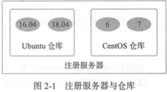

# 第2章 核心概念与安装配置

本章重点:

- 镜像(Image)
- 容器(Container)
- 仓库(Repository)

## 2.1 核心概念

##### 1. Docker镜像

Docker镜像类似于虚拟机镜像(iso),**可以将它理解为一个只读的模板.**

例如:1个镜像可以包含1个基本的OS环境,里边仅安装了Apache应用程序(或用户需要的其他软件),可以把它称为1个Apache镜像.(也就是说所有的镜像必须有一个OS环境,在该环境上再安装其他Application?)

镜像是创建Docker容器的基础.通过版本管理和增量的文件系统,Docker提供了一套十分简单的机制来创建和更新现有的镜像,用户甚至可以从网上下载一个已经做好的应用镜像,并直接使用.

##### 2. Docker容器

**Docker仓库类似于代码仓库,是Docker集中存放镜像文件的场所.**

有时我们会将Docker仓库和仓库注册服务器(Registry)混为一谈,并不严格区分.实际上,**仓库注册服务器是存放仓库的地方,其上往往存在着多个仓库.每个仓库集中存放某一类的镜像,往往1个仓库中包含多个镜像文件,通过不同的标签(tag)来进行区分.**例如存放UbuntuOS镜像的仓库,被称为Ubuntu仓库,其中可能包括16.04、18.94等不同版本的镜像.



根据所存储的镜像公开分享与否,Docker仓库可以分为公开仓库(Public)和私有仓库(Private)两种形式.

目前,最大的公开仓库是官方提供的Docker Hub,其中存放着数量庞大的镜像供用户下载.国内不少云服务提供商(如腾讯云、阿里云等)也提供了仓库的本地源,可以提供稳定的国内访问.

当然,用户如果不希望公开分享自己的镜像文件,Docker也支持用户**在本地网络内创建一个只能自己访问的私有仓库**.

当用户创建了自己的镜像之后就可以使用`push`命令将它上传到指定的公有或者私有仓库.这样用户下次在另外一台机器上使用该镜像时,只需要将其从仓库上pull下来就可以了.

**可以看出,Docker利用仓库管理镜像的设计理念与Git代码仓库的概念非常相似.实际上Docker设计上借鉴了Git的很多优秀思想.**

## 2.2 安装Docker引擎

Docker支持的服务:

- Docker引擎

	包括支持在桌面系统或云平台安装Docker,以及为企业提供简单安全
弹性的容器集群编排和管理

- DockerHub

	官方提供的云托管服务.可以提供公有或私有的镜像仓库

- DockerCloud

	官方提供的容器云服务.可以完成容器的部署与管理,可以完整地支
持容器化项目.还有CI、CD功能

### 2.2.1 Ubuntu环境下安装Docker

##### 1. 系统要求

Docker目前支持的最低Ubuntu版本为14.04 LTS.但实际上从稳定性上考虑,推荐使用16.04 LTS或18.0.4 LTS版本,并且系统内核越新越好,以支持 Docker最新的特性.

查看内核版本详细信息:
 
```
root@docker-test:/home/roach# uname -a
Linux docker-test 5.4.0-94-generic #106-Ubuntu SMP Thu Jan 6 23:58:14 UTC 2022 x86_64 x86_64 x86_64 GNU/Linux
```

或者:

```
root@docker-test:/home/roach# cat /proc/version
Linux version 5.4.0-94-generic (buildd@lcy02-amd64-053) (gcc version 9.3.0 (Ubuntu 9.3.0-17ubuntu1~20.04)) #106-Ubuntu SMP Thu Jan 6 23:58:14 UTC 2022
```

如果使用Ubuntu16.04 LTS版本,为了让Docker使用aufs存储,推荐安装如下两个软件包:(我的版本是20.04,所以就不装了)

```
$ sudo apt-get update
$ sudo apt-get install -y \
	linux-image-extra $(uname -r) \
	linux image-extra-virtual
```

##### 2. 添加镜像源

首先安装`apt-transport-https`等软件包,支持https协议的源:

```
$ sudo apt-get update
$ sudo apt-get install \
	apt-transport https \
	ca-certificates \
	curl \
	software-properties-common
```

```
root@docker-test:/home/roach# sudo apt-get update
Hit:1 http://cn.archive.ubuntu.com/ubuntu focal InRelease
Hit:2 http://cn.archive.ubuntu.com/ubuntu focal-updates InRelease
Hit:3 http://cn.archive.ubuntu.com/ubuntu focal-backports InRelease
Hit:4 http://cn.archive.ubuntu.com/ubuntu focal-security InRelease
Reading package lists... Done
root@docker-test:/home/roach# sudo apt-get install apt-transport-https ca-certificates curl software-properties-common
Reading package lists... Done
Building dependency tree       
Reading state information... Done
ca-certificates is already the newest version (20210119~20.04.2).
ca-certificates set to manually installed.
curl is already the newest version (7.68.0-1ubuntu2.7).
curl set to manually installed.
The following additional packages will be installed:
  python3-software-properties
The following NEW packages will be installed:
  apt-transport-https
The following packages will be upgraded:
  python3-software-properties software-properties-common
2 upgraded, 1 newly installed, 0 to remove and 35 not upgraded.
Need to get 40.2 kB of archives.
After this operation, 162 kB of additional disk space will be used.
Do you want to continue? [Y/n] y
Get:1 http://cn.archive.ubuntu.com/ubuntu focal-updates/universe amd64 apt-transport-https all 2.0.6 [4,680 B]
Get:2 http://cn.archive.ubuntu.com/ubuntu focal-updates/main amd64 software-properties-common all 0.99.9.8 [10.6 kB]
Get:3 http://cn.archive.ubuntu.com/ubuntu focal-updates/main amd64 python3-software-properties all 0.99.9.8 [24.9 kB]
Fetched 40.2 kB in 2s (24.8 kB/s)                 
Selecting previously unselected package apt-transport-https.
(Reading database ... 108171 files and directories currently installed.)
Preparing to unpack .../apt-transport-https_2.0.6_all.deb ...
Unpacking apt-transport-https (2.0.6) ...
Preparing to unpack .../software-properties-common_0.99.9.8_all.deb ...
Unpacking software-properties-common (0.99.9.8) over (0.98.9.5) ...
Preparing to unpack .../python3-software-properties_0.99.9.8_all.deb ...
Unpacking python3-software-properties (0.99.9.8) over (0.98.9.5) ...
Setting up apt-transport-https (2.0.6) ...
Setting up python3-software-properties (0.99.9.8) ...
Setting up software-properties-common (0.99.9.8) ...
Processing triggers for man-db (2.9.1-1) ...
Processing triggers for dbus (1.12.16-2ubuntu2.1) ...
```

添加源的gpg密钥:

```
$ curl -fsSL https://download.docker.com/linux/ubuntu/gpg | sudo apt-key add -
```

```
root@docker-test:/home/roach# curl -fsSL https://download.docker.com/linux/ubuntu/gpg | sudo apt-key add -
OK
root@docker-test:/home/roach# apt-key list
/etc/apt/trusted.gpg
--------------------
pub   rsa4096 2017-02-22 [SCEA]
      9DC8 5822 9FC7 DD38 854A  E2D8 8D81 803C 0EBF CD88
uid           [ unknown] Docker Release (CE deb) <docker@docker.com>
sub   rsa4096 2017-02-22 [S]

/etc/apt/trusted.gpg.d/ubuntu-keyring-2012-archive.gpg
------------------------------------------------------
pub   rsa4096 2012-05-11 [SC]
      790B C727 7767 219C 42C8  6F93 3B4F E6AC C0B2 1F32
uid           [ unknown] Ubuntu Archive Automatic Signing Key (2012) <ftpmaster@ubuntu.com>

/etc/apt/trusted.gpg.d/ubuntu-keyring-2012-cdimage.gpg
------------------------------------------------------
pub   rsa4096 2012-05-11 [SC]
      8439 38DF 228D 22F7 B374  2BC0 D94A A3F0 EFE2 1092
uid           [ unknown] Ubuntu CD Image Automatic Signing Key (2012) <cdimage@ubuntu.com>

/etc/apt/trusted.gpg.d/ubuntu-keyring-2018-archive.gpg
------------------------------------------------------
pub   rsa4096 2018-09-17 [SC]
      F6EC B376 2474 EDA9 D21B  7022 8719 20D1 991B C93C
uid           [ unknown] Ubuntu Archive Automatic Signing Key (2018) <ftpmaster@ubuntu.com>
```

可以看到,指纹为:`9DC8 5822 9FC7 DD38 854A  E2D8 8D81 803C 0EBF CD88`

确认导入指纹为`9DC8 5822 9FC7 DD38 854A  E2D8 8D81 803C 0EBF CD88`的GPG公钥:

```
sudo apt-key fingerprint OEBFCD88
```

```
root@docker-test:/home/roach# sudo apt-key fingerprint 0EBFCD88
pub   rsa4096 2017-02-22 [SCEA]
      9DC8 5822 9FC7 DD38 854A  E2D8 8D81 803C 0EBF CD88
uid           [ unknown] Docker Release (CE deb) <docker@docker.com>
sub   rsa4096 2017-02-22 [S]
```

获取当前OS的代号:

```
lsb_release -cs
```

```
root@docker-test:/home/roach# lsb_release -cs
focal
```

写入软件源信息:

```
sudo add-apt-repository \
"deb [arch=amd64] https://download.docker.com/linux/ubuntu  \
$(lsb_release -cs) \
stable"
```

```
root@docker-test:/home/roach# sudo add-apt-repository "deb [arch=amd64] https://download.docker.com/linux/ubuntu $(lsb_release -cs) stable"
Get:1 https://download.docker.com/linux/ubuntu focal InRelease [57.7 kB]     
Get:2 https://download.docker.com/linux/ubuntu focal/stable amd64 Packages [13.5 kB]
Hit:3 http://cn.archive.ubuntu.com/ubuntu focal InRelease
Hit:4 http://cn.archive.ubuntu.com/ubuntu focal-updates InRelease
Hit:5 http://cn.archive.ubuntu.com/ubuntu focal-backports InRelease
Hit:6 http://cn.archive.ubuntu.com/ubuntu focal-security InRelease
Fetched 71.2 kB in 2s (40.1 kB/s)
Reading package lists... Done
```

再次更新apt软件包缓存:

```
sudo apt-get update
```

```
root@docker-test:/home/roach# sudo apt-get update
Hit:1 https://download.docker.com/linux/ubuntu focal InRelease
Hit:2 http://cn.archive.ubuntu.com/ubuntu focal InRelease
Hit:3 http://cn.archive.ubuntu.com/ubuntu focal-updates InRelease
Hit:4 http://cn.archive.ubuntu.com/ubuntu focal-backports InRelease
Hit:5 http://cn.archive.ubuntu.com/ubuntu focal-security InRelease
Reading package lists... Done
```

##### 3. 开始安装Docker

```
sudo apt-get install -y docker-ce
```

```
root@docker-test:/home/roach# sudo apt-get install -y docker-ce
Reading package lists... Done
Building dependency tree       
Reading state information... Done
The following additional packages will be installed:
  containerd.io docker-ce-cli docker-ce-rootless-extras docker-scan-plugin pigz slirp4netns
Suggested packages:
  aufs-tools cgroupfs-mount | cgroup-lite
The following NEW packages will be installed:
  containerd.io docker-ce docker-ce-cli docker-ce-rootless-extras docker-scan-plugin pigz slirp4netns
0 upgraded, 7 newly installed, 0 to remove and 35 not upgraded.
Need to get 97.2 MB of archives.
After this operation, 409 MB of additional disk space will be used.
Get:1 https://download.docker.com/linux/ubuntu focal/stable amd64 containerd.io amd64 1.4.12-1 [23.7 MB]
Get:2 http://cn.archive.ubuntu.com/ubuntu focal/universe amd64 pigz amd64 2.4-1 [57.4 kB]
Get:3 http://cn.archive.ubuntu.com/ubuntu focal/universe amd64 slirp4netns amd64 0.4.3-1 [74.3 kB]
Get:4 https://download.docker.com/linux/ubuntu focal/stable amd64 docker-ce-cli amd64 5:20.10.12~3-0~ubuntu-focal [40.7 MB]
Get:5 https://download.docker.com/linux/ubuntu focal/stable amd64 docker-ce amd64 5:20.10.12~3-0~ubuntu-focal [21.2 MB]                                                                                                                                                        
Get:6 https://download.docker.com/linux/ubuntu focal/stable amd64 docker-ce-rootless-extras amd64 5:20.10.12~3-0~ubuntu-focal [7,921 kB]                                                                                                                                       
Get:7 https://download.docker.com/linux/ubuntu focal/stable amd64 docker-scan-plugin amd64 0.12.0~ubuntu-focal [3,518 kB]                                                                                                                                                      
Fetched 97.2 MB in 18s (5,358 kB/s)                                                                                                                                                                                                                                            
Selecting previously unselected package pigz.
(Reading database ... 108175 files and directories currently installed.)
Preparing to unpack .../0-pigz_2.4-1_amd64.deb ...
Unpacking pigz (2.4-1) ...
Selecting previously unselected package containerd.io.
Preparing to unpack .../1-containerd.io_1.4.12-1_amd64.deb ...
Unpacking containerd.io (1.4.12-1) ...
Selecting previously unselected package docker-ce-cli.
Preparing to unpack .../2-docker-ce-cli_5%3a20.10.12~3-0~ubuntu-focal_amd64.deb ...
Unpacking docker-ce-cli (5:20.10.12~3-0~ubuntu-focal) ...
Selecting previously unselected package docker-ce.
Preparing to unpack .../3-docker-ce_5%3a20.10.12~3-0~ubuntu-focal_amd64.deb ...
Unpacking docker-ce (5:20.10.12~3-0~ubuntu-focal) ...
Selecting previously unselected package docker-ce-rootless-extras.
Preparing to unpack .../4-docker-ce-rootless-extras_5%3a20.10.12~3-0~ubuntu-focal_amd64.deb ...
Unpacking docker-ce-rootless-extras (5:20.10.12~3-0~ubuntu-focal) ...
Selecting previously unselected package docker-scan-plugin.
Preparing to unpack .../5-docker-scan-plugin_0.12.0~ubuntu-focal_amd64.deb ...
Unpacking docker-scan-plugin (0.12.0~ubuntu-focal) ...
Selecting previously unselected package slirp4netns.
Preparing to unpack .../6-slirp4netns_0.4.3-1_amd64.deb ...
Unpacking slirp4netns (0.4.3-1) ...
Setting up slirp4netns (0.4.3-1) ...
Setting up docker-scan-plugin (0.12.0~ubuntu-focal) ...
Setting up containerd.io (1.4.12-1) ...
Created symlink /etc/systemd/system/multi-user.target.wants/containerd.service → /lib/systemd/system/containerd.service.
Setting up docker-ce-cli (5:20.10.12~3-0~ubuntu-focal) ...
Setting up pigz (2.4-1) ...
Setting up docker-ce-rootless-extras (5:20.10.12~3-0~ubuntu-focal) ...
Setting up docker-ce (5:20.10.12~3-0~ubuntu-focal) ...
Created symlink /etc/systemd/system/multi-user.target.wants/docker.service → /lib/systemd/system/docker.service.
Created symlink /etc/systemd/system/sockets.target.wants/docker.socket → /lib/systemd/system/docker.socket.
Processing triggers for man-db (2.9.1-1) ...
Processing triggers for systemd (245.4-4ubuntu3.15) ...
```

### 2.2.2 CentOS环境下安装Docker

略

### 2.2.3 通过脚本安装

略

### 2.2.4 macOS 环境下安装Docker

略

### 2.2.5 Windows 环境下安装Docker

略

## 2.3 配置Docker服务

为避免每次使用Docker命令时都需要切换到特权身份,可将当前用户加入安装中自动创建的docker用户组:

```
sudo usermod -aG docker USER_NAME
```

```
root@docker-test:/home/roach# sudo usermod -aG docker root
```

配置Docker启动参数:启动参数写入`/etc/docker/daemon.json`中即可.

```
{
	"debug” : true,
	”hosts”:[” tcp://127.0.0 .1:2376”]
}
```

注:初态没有这个文件,需要自己创建并写入启动参数.

修改后通过`service`命令来重启Docker服务

```
sudo service docker restart
```

```
root@docker-test:/home/roach# sudo service docker restart
root@docker-test:/home/roach# ps -ef|grep docker
root       18175       1  1 08:35 ?        00:00:00 /usr/bin/dockerd -H fd:// --containerd=/run/containerd/containerd.sock
root       18317   14483  0 08:35 pts/0    00:00:00 grep --color=auto docker
```

查看Docker服务的日志信息:

```
journalctl -u docker.service
```

```
root@docker-test:/home/roach# journalctl -u docker.service
-- Logs begin at Tue 2022-01-11 04:42:23 UTC, end at Thu 2022-01-13 08:35:32 UTC. --
Jan 13 08:27:36 docker-test systemd[1]: Starting Docker Application Container Engine...
Jan 13 08:27:36 docker-test dockerd[17050]: time="2022-01-13T08:27:36.280301781Z" level=info msg="Starting up"
Jan 13 08:27:36 docker-test dockerd[17050]: time="2022-01-13T08:27:36.282340892Z" level=info msg="detected 127.0.0.53 nameserver, assuming systemd-resolved, so using resolv.conf: /run/systemd/resolve/resolv.conf"
Jan 13 08:27:36 docker-test dockerd[17050]: time="2022-01-13T08:27:36.337025697Z" level=info msg="parsed scheme: \"unix\"" module=grpc
Jan 13 08:27:36 docker-test dockerd[17050]: time="2022-01-13T08:27:36.337163446Z" level=info msg="scheme \"unix\" not registered, fallback to default scheme" module=grpc
Jan 13 08:27:36 docker-test dockerd[17050]: time="2022-01-13T08:27:36.337256790Z" level=info msg="ccResolverWrapper: sending update to cc: {[{unix:///run/containerd/containerd.sock  <nil> 0 <nil>}] <nil> <nil>}" module=grpc
Jan 13 08:27:36 docker-test dockerd[17050]: time="2022-01-13T08:27:36.337468396Z" level=info msg="ClientConn switching balancer to \"pick_first\"" module=grpc
Jan 13 08:27:36 docker-test dockerd[17050]: time="2022-01-13T08:27:36.338503822Z" level=info msg="parsed scheme: \"unix\"" module=grpc
Jan 13 08:27:36 docker-test dockerd[17050]: time="2022-01-13T08:27:36.338589511Z" level=info msg="scheme \"unix\" not registered, fallback to default scheme" module=grpc
Jan 13 08:27:36 docker-test dockerd[17050]: time="2022-01-13T08:27:36.338675128Z" level=info msg="ccResolverWrapper: sending update to cc: {[{unix:///run/containerd/containerd.sock  <nil> 0 <nil>}] <nil> <nil>}" module=grpc
Jan 13 08:27:36 docker-test dockerd[17050]: time="2022-01-13T08:27:36.338757943Z" level=info msg="ClientConn switching balancer to \"pick_first\"" module=grpc
Jan 13 08:27:36 docker-test dockerd[17050]: time="2022-01-13T08:27:36.396122856Z" level=warning msg="Your kernel does not support swap memory limit"
Jan 13 08:27:36 docker-test dockerd[17050]: time="2022-01-13T08:27:36.396308793Z" level=warning msg="Your kernel does not support CPU realtime scheduler"
Jan 13 08:27:36 docker-test dockerd[17050]: time="2022-01-13T08:27:36.396390145Z" level=warning msg="Your kernel does not support cgroup blkio weight"
Jan 13 08:27:36 docker-test dockerd[17050]: time="2022-01-13T08:27:36.396466741Z" level=warning msg="Your kernel does not support cgroup blkio weight_device"
Jan 13 08:27:36 docker-test dockerd[17050]: time="2022-01-13T08:27:36.396651786Z" level=info msg="Loading containers: start."
Jan 13 08:27:36 docker-test dockerd[17050]: time="2022-01-13T08:27:36.499454947Z" level=info msg="Default bridge (docker0) is assigned with an IP address 172.17.0.0/16. Daemon option --bip can be used to set a preferred IP address"
Jan 13 08:27:36 docker-test dockerd[17050]: time="2022-01-13T08:27:36.558598860Z" level=info msg="Loading containers: done."
Jan 13 08:27:36 docker-test dockerd[17050]: time="2022-01-13T08:27:36.584746706Z" level=info msg="Docker daemon" commit=459d0df graphdriver(s)=overlay2 version=20.10.12
Jan 13 08:27:36 docker-test dockerd[17050]: time="2022-01-13T08:27:36.584965998Z" level=info msg="Daemon has completed initialization"
Jan 13 08:27:36 docker-test systemd[1]: Started Docker Application Container Engine.
Jan 13 08:27:36 docker-test dockerd[17050]: time="2022-01-13T08:27:36.610380658Z" level=info msg="API listen on /run/docker.sock"
Jan 13 08:35:32 docker-test dockerd[17050]: time="2022-01-13T08:35:32.046305411Z" level=info msg="Processing signal 'terminated'"
Jan 13 08:35:32 docker-test dockerd[17050]: time="2022-01-13T08:35:32.046932470Z" level=info msg="Daemon shutdown complete"
Jan 13 08:35:32 docker-test systemd[1]: Stopping Docker Application Container Engine...
Jan 13 08:35:32 docker-test systemd[1]: docker.service: Succeeded.
Jan 13 08:35:32 docker-test systemd[1]: Stopped Docker Application Container Engine.
Jan 13 08:35:32 docker-test systemd[1]: Starting Docker Application Container Engine...
Jan 13 08:35:32 docker-test dockerd[18175]: time="2022-01-13T08:35:32.122822422Z" level=info msg="Starting up"
Jan 13 08:35:32 docker-test dockerd[18175]: time="2022-01-13T08:35:32.124205960Z" level=info msg="detected 127.0.0.53 nameserver, assuming systemd-resolved, so using resolv.conf: /run/systemd/resolve/resolv.conf"
Jan 13 08:35:32 docker-test dockerd[18175]: time="2022-01-13T08:35:32.125264441Z" level=info msg="parsed scheme: \"unix\"" module=grpc
Jan 13 08:35:32 docker-test dockerd[18175]: time="2022-01-13T08:35:32.125355912Z" level=info msg="scheme \"unix\" not registered, fallback to default scheme" module=grpc
Jan 13 08:35:32 docker-test dockerd[18175]: time="2022-01-13T08:35:32.125448711Z" level=info msg="ccResolverWrapper: sending update to cc: {[{unix:///run/containerd/containerd.sock  <nil> 0 <nil>}] <nil> <nil>}" module=grpc
Jan 13 08:35:32 docker-test dockerd[18175]: time="2022-01-13T08:35:32.125569194Z" level=info msg="ClientConn switching balancer to \"pick_first\"" module=grpc
Jan 13 08:35:32 docker-test dockerd[18175]: time="2022-01-13T08:35:32.126366538Z" level=info msg="parsed scheme: \"unix\"" module=grpc
Jan 13 08:35:32 docker-test dockerd[18175]: time="2022-01-13T08:35:32.126454936Z" level=info msg="scheme \"unix\" not registered, fallback to default scheme" module=grpc
Jan 13 08:35:32 docker-test dockerd[18175]: time="2022-01-13T08:35:32.126577708Z" level=info msg="ccResolverWrapper: sending update to cc: {[{unix:///run/containerd/containerd.sock  <nil> 0 <nil>}] <nil> <nil>}" module=grpc
Jan 13 08:35:32 docker-test dockerd[18175]: time="2022-01-13T08:35:32.126662765Z" level=info msg="ClientConn switching balancer to \"pick_first\"" module=grpc
Jan 13 08:35:32 docker-test dockerd[18175]: time="2022-01-13T08:35:32.151238558Z" level=info msg="[graphdriver] using prior storage driver: overlay2"
Jan 13 08:35:32 docker-test dockerd[18175]: time="2022-01-13T08:35:32.161101048Z" level=warning msg="Your kernel does not support swap memory limit"
Jan 13 08:35:32 docker-test dockerd[18175]: time="2022-01-13T08:35:32.161223109Z" level=warning msg="Your kernel does not support CPU realtime scheduler"
Jan 13 08:35:32 docker-test dockerd[18175]: time="2022-01-13T08:35:32.161304906Z" level=warning msg="Your kernel does not support cgroup blkio weight"
Jan 13 08:35:32 docker-test dockerd[18175]: time="2022-01-13T08:35:32.161382783Z" level=warning msg="Your kernel does not support cgroup blkio weight_device"
Jan 13 08:35:32 docker-test dockerd[18175]: time="2022-01-13T08:35:32.161567457Z" level=info msg="Loading containers: start."
Jan 13 08:35:32 docker-test dockerd[18175]: time="2022-01-13T08:35:32.225492220Z" level=info msg="Default bridge (docker0) is assigned with an IP address 172.17.0.0/16. Daemon option --bip can be used to set a preferred IP address"
Jan 13 08:35:32 docker-test dockerd[18175]: time="2022-01-13T08:35:32.252242198Z" level=info msg="Loading containers: done."
Jan 13 08:35:32 docker-test dockerd[18175]: time="2022-01-13T08:35:32.274699593Z" level=info msg="Docker daemon" commit=459d0df graphdriver(s)=overlay2 version=20.10.12
Jan 13 08:35:32 docker-test dockerd[18175]: time="2022-01-13T08:35:32.274890643Z" level=info msg="Daemon has completed initialization"
Jan 13 08:35:32 docker-test systemd[1]: Started Docker Application Container Engine.
Jan 13 08:35:32 docker-test dockerd[18175]: time="2022-01-13T08:35:32.291720800Z" level=info msg="API listen on /run/docker.sock"
```

每次重启Docker服务后,可通过`docker info`查看Docker信息,确保服务已正常运行.

```
root@docker-test:/home/roach# docker info
Client:
 Context:    default
 Debug Mode: false
 Plugins:
  app: Docker App (Docker Inc., v0.9.1-beta3)
  buildx: Docker Buildx (Docker Inc., v0.7.1-docker)
  scan: Docker Scan (Docker Inc., v0.12.0)

Server:
 Containers: 0
  Running: 0
  Paused: 0
  Stopped: 0
 Images: 0
 Server Version: 20.10.12
 Storage Driver: overlay2
  Backing Filesystem: extfs
  Supports d_type: true
  Native Overlay Diff: true
  userxattr: false
 Logging Driver: json-file
 Cgroup Driver: cgroupfs
 Cgroup Version: 1
 Plugins:
  Volume: local
  Network: bridge host ipvlan macvlan null overlay
  Log: awslogs fluentd gcplogs gelf journald json-file local logentries splunk syslog
 Swarm: inactive
 Runtimes: runc io.containerd.runc.v2 io.containerd.runtime.v1.linux
 Default Runtime: runc
 Init Binary: docker-init
 containerd version: 7b11cfaabd73bb80907dd23182b9347b4245eb5d
 runc version: v1.0.2-0-g52b36a2
 init version: de40ad0
 Security Options:
  apparmor
  seccomp
   Profile: default
 Kernel Version: 5.4.0-94-generic
 Operating System: Ubuntu 20.04.3 LTS
 OSType: linux
 Architecture: x86_64
 CPUs: 1
 Total Memory: 11.7GiB
 Name: docker-test
 ID: UOMX:TXX4:23S5:OMIM:HFYN:W542:XIQ5:XYM2:P6NF:CCTD:DVYT:7FAE
 Docker Root Dir: /var/lib/docker
 Debug Mode: false
 Registry: https://index.docker.io/v1/
 Labels:
 Experimental: false
 Insecure Registries:
  127.0.0.0/8
 Live Restore Enabled: false

WARNING: No swap limit support
```

## 2.4 推荐实践环境

OS:Ubuntu 18.04 LTS以上

内核:Linux 4.0以上

如无特殊说明,默认数据网段地址范围为10.0.0.0/24,管理网段地址范围为 192.168.0.0/24

执行命令代码中以`$`开头的,表明为普通用户;以`#`开头的,表明为特权用户 (root)


