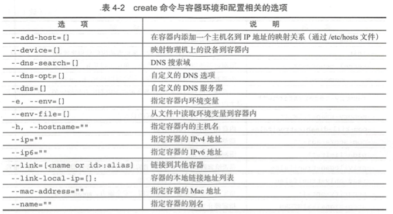

# 第4章 操作Docker容器

容器是Docker的另一个核心概念.**简单来讲,容器是镜像的一个运行实例.所不同的是,镜像是静态的只读文件,而容器带有运行时需要的可写文件层,同时容器中的应用进程处于运行状态.**

如果认为虚拟机是模拟运行的一整套OS(包括内核、应用运行态环境和其他系统环境)以及跑在它上面的应用.那么Docker容器就是独立运行的1个(或1组)应用,以及应用所必须的运行环境.

## 4.1 创建容器

##### 1. 新建容器

`docker create`:新建容器

例:新建一个基于镜像`ubuntu:latest`的容器

- step1. 创建容器

```
root@docker-test:/home/roach# docker create -it ubuntu:latest
758b9392d3b5dbd7fa311a9cb12a41157b0a897103c4119dbd3f6a3fa3f4dd4f
```

- step2. 查看结果

```
root@docker-test:/home/roach# docker ps -a
CONTAINER ID   IMAGE           COMMAND       CREATED          STATUS                    PORTS     NAMES
758b9392d3b5   ubuntu:latest   "bash"        47 seconds ago   Created                             stoic_bardeen
2e67bf264388   ubuntu:18.04    "/bin/bash"   13 hours ago     Exited (0) 13 hours ago             youthful_shamir
```

通过`docker create`命令新建的容器处于停止状态,可以使用`docker start`命令来启动该容器.

容器是Docker技术栈的核心,`docker create`和`docker run`命令支持的选项都很复杂.

`create`子命令的选项包含如下几类:

1. 与容器运行模式相关
2. 与容器环境配置相关
3. 与容器资源限制和安全保护相关

create命令与容器运行模式相关的选项:


create命令与容器环境和配置相关的选项



create命令与容器资源限制和安全保护相关的选项


其他选项包括:

- `-l`,`--label=[]`:以键值对方式指定容器的标签信息
- `--label-file=[]`:从文件中读取标签信息

所以,刚刚例子中的`docker create -it`的意思就是:

`-i`:保持标准输入打开

`-t`:分配一个伪终端

##### 2. 启动容器

`docker start`:启动容器

例:启动刚刚创建的`ubuntu:latest`容器

- step1. 查看容器

```
root@docker-test:/home/roach# docker ps -a
CONTAINER ID   IMAGE           COMMAND       CREATED          STATUS                    PORTS     NAMES
758b9392d3b5   ubuntu:latest   "bash"        16 minutes ago   Created                             stoic_bardeen
2e67bf264388   ubuntu:18.04    "/bin/bash"   13 hours ago     Exited (0) 13 hours ago             youthful_shamir
```

- step2. 启动容器

```
root@docker-test:/home/roach# docker start 758b9392d3b5
758b9392d3b5
```

- step3. 查看容器状态

```
root@docker-test:/home/roach# docker ps
CONTAINER ID   IMAGE           COMMAND   CREATED          STATUS          PORTS     NAMES
758b9392d3b5   ubuntu:latest   "bash"    16 minutes ago   Up 16 seconds             stoic_bardeen
```

##### 3. 新建并启动容器

`docker run`:新建并启动容器.该命令等价于先执行`docker create`,再执行`docker start`

例:新建一个`ubuntu:18.04`的容器并输出一个"Fuck world",之后容器自动终止

- step1. 创建容器并输出

```
root@docker-test:/home/roach# docker run ubuntu:18.04 /bin/echo "Fuck world"
Fuck world
```

- step2. 查看容器状态

```
root@docker-test:/home/roach# docker ps -a --no-trunc
CONTAINER ID                                                       IMAGE           COMMAND                    CREATED          STATUS                     PORTS     NAMES
6aa9c3ceb55ebd82a6701ae3eac757b840cae3633efc893d75926fe100e386a4   ubuntu:18.04    "/bin/echo 'Fuck world'"   10 seconds ago   Exited (0) 9 seconds ago             romantic_shamir
758b9392d3b5dbd7fa311a9cb12a41157b0a897103c4119dbd3f6a3fa3f4dd4f   ubuntu:latest   "bash"                     21 minutes ago   Up 4 minutes                         stoic_bardeen
2e67bf26438873ba674426319b08ed79c0f69cc389e6f34092abd3be3fd9ed4d   ubuntu:18.04    "/bin/bash"                13 hours ago     Exited (0) 13 hours ago              youthful_shamir
```

可以看到容器在执行完输出命令后,处于退出状态

当利用`docker run`命令来创建并启动容器时,Docker在后台运行的标准操作包括:

- step1. 检查本地是否存在指定的镜像,不存在就从公有仓库下载
- step2. 利用镜像创建一个容器,并启动该容器
- step3. 分配一个文件系统给容器,并在只读的镜像层外面挂载一层可读可写层
- step4. 从宿主主机配置的网桥接口中,桥接一个虚拟接口到容器中去
- step5. 从网桥的地址池配置一个IP地址给容器
- step6. 执行用户执行的应用程序
- step7. 执行完毕后容器被自动终止

例:启动一个`bash`终端,并允许用户进行交互:

```
root@docker-test:/home/roach# docker run -it ubuntu:18.04 /bin/bash
root@7d29a66ee410:/# echo "fuck"
fuck
root@7d29a66ee410:/# echo "shit"
shit
root@7d29a66ee410:/# exit
exit
root@docker-test:/home/roach# docker ps -a --no-trunc
CONTAINER ID                                                       IMAGE           COMMAND                    CREATED          STATUS                      PORTS     NAMES
7d29a66ee4107054d0ff9f0f2dc316af1de23dcd2bae8216dc0eaab2c8a622b6   ubuntu:18.04    "/bin/bash"                25 seconds ago   Exited (0) 16 seconds ago             crazy_chaplygin
6aa9c3ceb55ebd82a6701ae3eac757b840cae3633efc893d75926fe100e386a4   ubuntu:18.04    "/bin/echo 'Fuck world'"   4 minutes ago    Exited (0) 4 minutes ago              romantic_shamir
758b9392d3b5dbd7fa311a9cb12a41157b0a897103c4119dbd3f6a3fa3f4dd4f   ubuntu:latest   "bash"                     25 minutes ago   Up 8 minutes                          stoic_bardeen
2e67bf26438873ba674426319b08ed79c0f69cc389e6f34092abd3be3fd9ed4d   ubuntu:18.04    "/bin/bash"                13 hours ago     Exited (0) 13 hours ago               youthful_shamir
```

在容器内用`ps`命令查看进程:

```
root@7d29a66ee410:/# ps
    PID TTY          TIME CMD
      1 pts/0    00:00:00 bash
     11 pts/0    00:00:00 ps
```

可以看到,只运行了`bash`应用,并没有运行其他无关的进程.`Ctrl + d`或`exit`命令可退出容器

对于刚刚创建的这个`bash`容器来讲,当用户使用`exit`退出`bash`进程之后,容器也会自动退出.**因为对于容器而言,当容器中的应用退出了,也就意味着容器的使命完成了,也就没有继续运行的必要了.**

`docker run`命令的常见错误:

- 125:Docker daemon执行出.例如指定了不支持的Docker命令参数
- 126:所指定命令无法执行,例如权限出错
- 127:容器内命令无法找到

命令执行后出错时会默认返回命令的退出错误码

##### 4. 守护态运行

`run`子命令的`-d`参数:让容器在后台以守护态(Daemonized)形式运行.

- step1. 创建并在后台运行一个容器,该容器的应用为`/bin/sh`,该应用以1s/次的速度打印"fuck world"

```
root@docker-test:/home/roach# docker run -d ubuntu:18.04 /bin/sh -c "while true; do echo fuck world; sleep 1; done"
4c5b595a538141241e69a5d146b8689e8ae1d28d4be24e6abaff87cb4931209b
```

- step2. 查看结果

```
root@docker-test:/home/roach# docker ps --no-trunc
CONTAINER ID                                                       IMAGE           COMMAND                                                        CREATED          STATUS          PORTS     NAMES
4c5b595a538141241e69a5d146b8689e8ae1d28d4be24e6abaff87cb4931209b   ubuntu:18.04    "/bin/sh -c 'while true; do echo fuck world; sleep 1; done'"   15 seconds ago   Up 14 seconds             nostalgic_euler
758b9392d3b5dbd7fa311a9cb12a41157b0a897103c4119dbd3f6a3fa3f4dd4f   ubuntu:latest   "bash"                                                         38 minutes ago   Up 21 minutes             stoic_bardeen
```

或`docker container ls`命令查看:

```
root@docker-test:/home/roach# docker container ls --no-trunc
CONTAINER ID                                                       IMAGE           COMMAND                                                        CREATED          STATUS          PORTS     NAMES
4c5b595a538141241e69a5d146b8689e8ae1d28d4be24e6abaff87cb4931209b   ubuntu:18.04    "/bin/sh -c 'while true; do echo fuck world; sleep 1; done'"   2 minutes ago    Up 2 minutes              nostalgic_euler
758b9392d3b5dbd7fa311a9cb12a41157b0a897103c4119dbd3f6a3fa3f4dd4f   ubuntu:latest   "bash"                                                         40 minutes ago   Up 23 minutes             stoic_bardeen
```

##### 5. 查看容器输出

`docker logs`:获取容器的输出信息

例:获取刚刚后台运行的容器的输出信息

- step1. 查看容器

```
root@docker-test:/home/roach# docker container ls
CONTAINER ID   IMAGE           COMMAND                  CREATED          STATUS          PORTS     NAMES
4c5b595a5381   ubuntu:18.04    "/bin/sh -c 'while t…"   4 minutes ago    Up 4 minutes              nostalgic_euler
758b9392d3b5   ubuntu:latest   "bash"                   42 minutes ago   Up 25 minutes             stoic_bardeen
```

- step2. 获取输出

```
root@docker-test:/home/roach# docker logs 4c5b595a5381
fuck world
fuck world
fuck world
fuck world
fuck world
fuck world
...
fuck world
root@docker-test:/home/roach# 
```

## 4.2 停止容器

##### 1. 暂停容器

`docker pause`:暂停容器

例:停止刚刚运行的循环输出的容器:

- step1. 查看容器

```
root@docker-test:/home/roach# docker ps
CONTAINER ID   IMAGE           COMMAND                  CREATED          STATUS          PORTS     NAMES
4c5b595a5381   ubuntu:18.04    "/bin/sh -c 'while t…"   20 minutes ago   Up 20 minutes             nostalgic_euler
758b9392d3b5   ubuntu:latest   "bash"                   58 minutes ago   Up 42 minutes             stoic_bardeen
```

- step2. 停止容器

```
root@docker-test:/home/roach# docker pause 4c5b595a5381
4c5b595a5381
```

- step3. 查看结果

```
root@docker-test:/home/roach# docker ps
CONTAINER ID   IMAGE           COMMAND                  CREATED          STATUS                   PORTS     NAMES
4c5b595a5381   ubuntu:18.04    "/bin/sh -c 'while t…"   21 minutes ago   Up 21 minutes (Paused)             nostalgic_euler
758b9392d3b5   ubuntu:latest   "bash"                   59 minutes ago   Up 43 minutes                      stoic_bardeen
```

也可以通过容器名称来暂停容器:

- step1. 创建并运行容器时,指定容器名称

```
root@docker-test:/home/roach# docker run --name test -itd ubuntu:18.04 bash
41ee1afc9afde3e617ba889404d8cd95e65f03d7bf82b3da82ab6012dc831da4
```

- step2. 查看结果

```
root@docker-test:/home/roach# docker ps
CONTAINER ID   IMAGE           COMMAND                  CREATED             STATUS                   PORTS     NAMES
41ee1afc9afd   ubuntu:18.04    "bash"                   6 seconds ago       Up 5 seconds                       test
4c5b595a5381   ubuntu:18.04    "/bin/sh -c 'while t…"   25 minutes ago      Up 25 minutes (Paused)             nostalgic_euler
758b9392d3b5   ubuntu:latest   "bash"                   About an hour ago   Up 47 minutes                      stoic_bardeen
```

- step3. 通过容器名称暂停容器

```
root@docker-test:/home/roach# docker pause test
test
```

- step4. 查看结果

```
root@docker-test:/home/roach# docker ps
CONTAINER ID   IMAGE           COMMAND                  CREATED              STATUS                       PORTS     NAMES
41ee1afc9afd   ubuntu:18.04    "bash"                   About a minute ago   Up About a minute (Paused)             test
4c5b595a5381   ubuntu:18.04    "/bin/sh -c 'while t…"   26 minutes ago       Up 26 minutes (Paused)                 nostalgic_euler
758b9392d3b5   ubuntu:latest   "bash"                   About an hour ago    Up 48 minutes                          stoic_bardeen
```

##### 2. 终止容器

`docker stop`:终止一个运行中的容器.

`stop`子命令支持的选项:

- `-t`,`--time`:指定等待时长.`docker stop`命令会先向容器发送`SIGTERM`信号,超过等待时长后,发送`SIGKILL`信号来终止容器.

例:终止刚刚运行的循环打印的容器:

- step1. 恢复该容器的运行

```
root@docker-test:/home/roach# docker ps
CONTAINER ID   IMAGE           COMMAND                  CREATED              STATUS                       PORTS     NAMES
41ee1afc9afd   ubuntu:18.04    "bash"                   About a minute ago   Up About a minute (Paused)             test
4c5b595a5381   ubuntu:18.04    "/bin/sh -c 'while t…"   26 minutes ago       Up 26 minutes (Paused)                 nostalgic_euler
758b9392d3b5   ubuntu:latest   "bash"                   About an hour ago    Up 48 minutes                          stoic_bardeen
root@docker-test:/home/roach# docker unpause 4c5b595a5381
4c5b595a5381
```

- step2. 终止容器

```
root@docker-test:/home/roach# docker stop 4c5b595a5381
4c5b595a5381
```

注:等待了10s

- step3. 查看结果

```
root@docker-test:/home/roach# docker ps -a
CONTAINER ID   IMAGE           COMMAND                  CREATED             STATUS                            PORTS     NAMES
41ee1afc9afd   ubuntu:18.04    "bash"                   8 minutes ago       Up 8 minutes (Paused)                       test
4c5b595a5381   ubuntu:18.04    "/bin/sh -c 'while t…"   34 minutes ago      Exited (137) About a minute ago             nostalgic_euler
7d29a66ee410   ubuntu:18.04    "/bin/bash"              47 minutes ago      Exited (0) 44 minutes ago                   crazy_chaplygin
6aa9c3ceb55e   ubuntu:18.04    "/bin/echo 'Fuck wor…"   50 minutes ago      Exited (0) 50 minutes ago                   romantic_shamir
758b9392d3b5   ubuntu:latest   "bash"                   About an hour ago   Up 55 minutes                               stoic_bardeen
2e67bf264388   ubuntu:18.04    "/bin/bash"              14 hours ago        Exited (0) 14 hours ago                     youthful_shamir
```

`docker start`:重新启动处于终止状态的容器

例:重新启动循环打印的容器

- step1. 重新启动

```
root@docker-test:/home/roach# docker start 4c5b595a5381
4c5b595a5381
```

- step2. 查看结果

```
root@docker-test:/home/roach# docker ps
CONTAINER ID   IMAGE           COMMAND                  CREATED             STATUS                  PORTS     NAMES
41ee1afc9afd   ubuntu:18.04    "bash"                   9 minutes ago       Up 9 minutes (Paused)             test
4c5b595a5381   ubuntu:18.04    "/bin/sh -c 'while t…"   35 minutes ago      Up 2 seconds                      nostalgic_euler
758b9392d3b5   ubuntu:latest   "bash"                   About an hour ago   Up 56 minutes                     stoic_bardeen
```

`docker restart`:将一个运行态的容器先终止,再重新启动

- step1. 重启

```
root@docker-test:/home/roach# docker restart -t 1 4c5b595a5381
4c5b595a5381
```

- step2. 查看结果

```
root@docker-test:/home/roach# docker ps
CONTAINER ID   IMAGE           COMMAND                  CREATED             STATUS                   PORTS     NAMES
41ee1afc9afd   ubuntu:18.04    "bash"                   13 minutes ago      Up 13 minutes (Paused)             test
4c5b595a5381   ubuntu:18.04    "/bin/sh -c 'while t…"   38 minutes ago      Up About a minute                  nostalgic_euler
758b9392d3b5   ubuntu:latest   "bash"                   About an hour ago   Up About an hour                   stoic_bardeen
```

## 4.3 进入容器

在创建或运行容器(也就是`docker create`或`docker run`)时,使用`-d`参数,容器启动后会进入后台,用户无法看到容器中的信息,也无法进行操作.此时想要操作容器,首先需要进入容器.

##### 1. 附着到容器的标准输出

`docker attach`:进入容器.其格式为:`docker [container] attach [--detach-keys[=[]]] [--no-stdin] [--sig-proxy=[=true]] CONTAINER`.该命令的作用为:附着到一个已经运行的容器的stdin,然后进行命令执行的动作.

该命令支持3个主要选项:

- `--detach-keys[=[]]`:指定退出`attach`模式的快捷键序列(TODO:这个快捷键序列是干啥的?),默认是`CTRL-p CTRL-q`.
- `--no-stdin=true|false`:是否关闭标准输入,默认保持打开
- `--sig-proxy=true|false`:是否代理收到的系统信号给应用进程,默认为true.

例:

- step1. 查看容器

```
root@docker-test:/home/roach# docker ps
CONTAINER ID   IMAGE           COMMAND                  CREATED             STATUS                   PORTS     NAMES
41ee1afc9afd   ubuntu:18.04    "bash"                   40 minutes ago      Up 40 minutes (Paused)             test
4c5b595a5381   ubuntu:18.04    "/bin/sh -c 'while t…"   About an hour ago   Up 29 minutes                      nostalgic_euler
758b9392d3b5   ubuntu:latest   "bash"                   2 hours ago         Up About an hour                   stoic_bardeen
```

- step2. 恢复容器

```
root@docker-test:/home/roach# docker unpause 41ee1afc9afd
41ee1afc9afd
```

- step3. 在容器中执行操作

```
root@41ee1afc9afd:/# ps
    PID TTY          TIME CMD
      1 pts/0    00:00:00 bash
     11 pts/0    00:00:00 ps
```

- step4. 退出

```
root@41ee1afc9afd:/# exit
exit
```

- step5. 查看结果

```
root@docker-test:/home/roach# docker ps -a
CONTAINER ID   IMAGE           COMMAND                  CREATED             STATUS                         PORTS     NAMES
41ee1afc9afd   ubuntu:18.04    "bash"                   42 minutes ago      Exited (0) 2 seconds ago                 test
4c5b595a5381   ubuntu:18.04    "/bin/sh -c 'while t…"   About an hour ago   Up 31 minutes                            nostalgic_euler
7d29a66ee410   ubuntu:18.04    "/bin/bash"              About an hour ago   Exited (0) About an hour ago             crazy_chaplygin
6aa9c3ceb55e   ubuntu:18.04    "/bin/echo 'Fuck wor…"   About an hour ago   Exited (0) About an hour ago             romantic_shamir
758b9392d3b5   ubuntu:latest   "bash"                   2 hours ago         Up About an hour                         stoic_bardeen
2e67bf264388   ubuntu:18.04    "/bin/bash"              14 hours ago        Exited (0) 14 hours ago                  youthful_shamir
```

可以看到,我们step4中执行的`exit`,实际上是希望退出该容器的stdin.但得到的效果是容器退出了.这说明`attach`子命令并不好用.

##### 2. 进入容器并执行命令

`docker exec`:在运行中的容器内,直接执行命令.基本格式:`docker [container] exec [-d|--detach] [--detach-keys[=[]]] [-i|--interactive] [--privileged] [-t|--tty] [-u|--user=[=USER]] CONTAINER COMMAND [ARG...]`

比较重要的参数:

- `-d`,`--detach`:在容器中后台执行命令
- `--detach-keys=""`:指定将容器切回后台的按键
- `-e`,`--env=[]`:指定环境变量列表
- `-i`,`--interactive=true|false`:打开标准输入,接受用户输入命令,默认值为false
- `--privileged=true|false`:是否给执行命令以最高权限,默认值为false
- `-t`,`--tty`:分配伪终端,默认值为false
- `-u`,`--user`:执行命令的用户名或ID

例:进入容器并执行操作

- step1. 查看容器

```
root@docker-test:/home/roach# docker ps -a
CONTAINER ID   IMAGE           COMMAND                  CREATED             STATUS                         PORTS     NAMES
41ee1afc9afd   ubuntu:18.04    "bash"                   50 minutes ago      Exited (0) 7 minutes ago                 test
4c5b595a5381   ubuntu:18.04    "/bin/sh -c 'while t…"   About an hour ago   Up 38 minutes                            nostalgic_euler
7d29a66ee410   ubuntu:18.04    "/bin/bash"              About an hour ago   Exited (0) About an hour ago             crazy_chaplygin
6aa9c3ceb55e   ubuntu:18.04    "/bin/echo 'Fuck wor…"   2 hours ago         Exited (0) 2 hours ago                   romantic_shamir
758b9392d3b5   ubuntu:latest   "bash"                   2 hours ago         Up 2 hours                               stoic_bardeen
2e67bf264388   ubuntu:18.04    "/bin/bash"              14 hours ago        Exited (0) 14 hours ago                  youthful_shamir
```

- step2. 运行容器

```
root@docker-test:/home/roach# docker start 41ee1afc9afd
41ee1afc9afd
```

- step3. 进入容器

```
root@docker-test:/home/roach# docker exec -it 41ee1afc9afd /bin/bash
root@41ee1afc9afd:/#
```

- step4. 在容器中查看进程信息

```
root@41ee1afc9afd:/# ps -ef
UID          PID    PPID  C STIME TTY          TIME CMD
root           1       0  0 08:17 pts/0    00:00:00 bash
root          11       0  0 08:18 pts/1    00:00:00 /bin/bash
root          21      11  0 08:18 pts/1    00:00:00 ps -ef
```

- step5. 在容器中查看用户信息

```
root@41ee1afc9afd:/# w
 08:19:15 up 10:05,  0 users,  load average: 0.00, 0.00, 0.00
USER     TTY      FROM             LOGIN@   IDLE   JCPU   PCPU WHAT
```

- step6. 退出容器

```
root@41ee1afc9afd:/# exit
exit
```

- step7. 查看容器

```
root@docker-test:/home/roach# docker ps
CONTAINER ID   IMAGE           COMMAND                  CREATED             STATUS          PORTS     NAMES
41ee1afc9afd   ubuntu:18.04    "bash"                   57 minutes ago      Up 2 minutes              test
4c5b595a5381   ubuntu:18.04    "/bin/sh -c 'while t…"   About an hour ago   Up 46 minutes             nostalgic_euler
758b9392d3b5   ubuntu:latest   "bash"                   2 hours ago         Up 2 hours                stoic_bardeen
```

可以看到,容器依旧处于运行状态.这说明通过`exec`子命令进入容器并退出后,不会影响容器的运行状态

**通过`exec`命令对容器执行操作时,指定`-it`参数来保持标准输入打开并分配一个伪终端,是最为推荐的方式.**

## 4.4 删除容器

`docker rm`:删除处于终止或退出状态的容器

主要支持的选项:

- `-f`,`--force=false`:是否强行终止并删除一个运行中的容器,默认为false
- `-l`,`--link=false`:删除容器的连接,但保留容器
- `-v`,`--volumes=false`:删除容器挂载的数据卷

例:查看处于终止状态的容器并删除

- step1. 查看容器

```
root@docker-test:/home/roach# docker ps -a
CONTAINER ID   IMAGE           COMMAND                  CREATED             STATUS                    PORTS     NAMES
41ee1afc9afd   ubuntu:18.04    "bash"                   About an hour ago   Up 15 minutes                       test
4c5b595a5381   ubuntu:18.04    "/bin/sh -c 'while t…"   2 hours ago         Up 59 minutes                       nostalgic_euler
7d29a66ee410   ubuntu:18.04    "/bin/bash"              2 hours ago         Exited (0) 2 hours ago              crazy_chaplygin
6aa9c3ceb55e   ubuntu:18.04    "/bin/echo 'Fuck wor…"   2 hours ago         Exited (0) 2 hours ago              romantic_shamir
758b9392d3b5   ubuntu:latest   "bash"                   2 hours ago         Up 2 hours                          stoic_bardeen
2e67bf264388   ubuntu:18.04    "/bin/bash"              15 hours ago        Exited (0) 15 hours ago             youthful_shamir
```

- step2. 终止容器

```
root@docker-test:/home/roach# docker stop 4c5b595a5381
4c5b595a5381
```

- step3. 删除容器

```
root@docker-test:/home/roach# docker rm 4c5b595a5381
4c5b595a5381
```

- step4. 查看结果

```
root@docker-test:/home/roach# docker ps -a
CONTAINER ID   IMAGE           COMMAND                  CREATED             STATUS                    PORTS     NAMES
41ee1afc9afd   ubuntu:18.04    "bash"                   About an hour ago   Up 16 minutes                       test
7d29a66ee410   ubuntu:18.04    "/bin/bash"              2 hours ago         Exited (0) 2 hours ago              crazy_chaplygin
6aa9c3ceb55e   ubuntu:18.04    "/bin/echo 'Fuck wor…"   2 hours ago         Exited (0) 2 hours ago              romantic_shamir
758b9392d3b5   ubuntu:latest   "bash"                   2 hours ago         Up 2 hours                          stoic_bardeen
2e67bf264388   ubuntu:18.04    "/bin/bash"              15 hours ago        Exited (0) 15 hours ago             youthful_shamir
```

默认情况下,`docker rm`命令只能删除处于终止或退出状态的容器,并不能删除还处于运行状态的容器.

若要直接删除一个处于运行状态的容器,可以添加`-f`参数.Docker会先发送`SIGKILL`信号(也就是执行`kill -9`命令)给容器,终止其中的应用,之后强行删除

例:终止一个运行中的容器

- step1. 创建一个运行的容器

```
root@docker-test:/home/roach# docker run -d ubuntu:18.04 /bin/sh -c "while true; do echo fuck world again; sleep 1; done"
ff29d56d34ddf1e0dc521a65f418a861bb04c5076526cf6d871d403d28d86dd3
```

- step2. 查看容器

```
root@docker-test:/home/roach# docker ps
CONTAINER ID   IMAGE          COMMAND                  CREATED          STATUS          PORTS     NAMES
ff29d56d34dd   ubuntu:18.04   "/bin/sh -c 'while t…"   38 seconds ago   Up 37 seconds             friendly_hawking
```

- step3. 尝试删除该容器

```
root@docker-test:/home/roach# docker rm ff29d56d34dd
Error response from daemon: You cannot remove a running container ff29d56d34ddf1e0dc521a65f418a861bb04c5076526cf6d871d403d28d86dd3. Stop the container before attempting removal or force remove
```

- step4. 强行删除该容器

```
root@docker-test:/home/roach# docker rm -f ff29d56d34dd
ff29d56d34dd
```

- step5. 查看结果

```
root@docker-test:/home/roach# docker ps -a
CONTAINER ID   IMAGE           COMMAND                  CREATED             STATUS                       PORTS     NAMES
41ee1afc9afd   ubuntu:18.04    "bash"                   About an hour ago   Exited (255) 6 minutes ago             test
7d29a66ee410   ubuntu:18.04    "/bin/bash"              2 hours ago         Exited (0) 2 hours ago                 crazy_chaplygin
6aa9c3ceb55e   ubuntu:18.04    "/bin/echo 'Fuck wor…"   2 hours ago         Exited (0) 2 hours ago                 romantic_shamir
758b9392d3b5   ubuntu:latest   "bash"                   3 hours ago         Exited (255) 6 minutes ago             stoic_bardeen
2e67bf264388   ubuntu:18.04    "/bin/bash"              15 hours ago        Exited (0) 15 hours ago                youthful_shamir
```

可以看到没有该容器了

## 4.5 导入和导出容器

本功能用于将容器从一个OS迁移到另一个OS.

##### 1. 导出容器

`docker export`:导出容器,无论该容器是否处于运行状态.命令格式为:`docker [container] export [-o|--output[=""]] CONTAINER`

- `-o`:指定导出的`tar`文件名.如果不使用该选项,也可通过重定向符来实现.

例:使用`-o`选项导出容器

- step1. 查看容器

```
root@docker-test:/home/roach# docker ps -a
CONTAINER ID   IMAGE           COMMAND                  CREATED             STATUS                       PORTS     NAMES
41ee1afc9afd   ubuntu:18.04    "bash"                   About an hour ago   Exited (255) 6 minutes ago             test
7d29a66ee410   ubuntu:18.04    "/bin/bash"              2 hours ago         Exited (0) 2 hours ago                 crazy_chaplygin
6aa9c3ceb55e   ubuntu:18.04    "/bin/echo 'Fuck wor…"   2 hours ago         Exited (0) 2 hours ago                 romantic_shamir
758b9392d3b5   ubuntu:latest   "bash"                   3 hours ago         Exited (255) 6 minutes ago             stoic_bardeen
2e67bf264388   ubuntu:18.04    "/bin/bash"              15 hours ago        Exited (0) 15 hours ago                youthful_shamir
```

- step2. 导出容器

```
root@docker-test:/home/roach# docker export -o test_for_bash.tar 41ee1afc9afd
```

- step3. 查看结果

```
root@docker-test:/home/roach# ls
Dockerfile  test_for_bash.tar  ubuntu-16.04-x86_64.tar.gz
```

例:使用重定向符导出容器

- step1. 查看容器

```
root@docker-test:/home/roach# docker ps -a
CONTAINER ID   IMAGE           COMMAND                  CREATED             STATUS                       PORTS     NAMES
41ee1afc9afd   ubuntu:18.04    "bash"                   About an hour ago   Exited (255) 6 minutes ago             test
7d29a66ee410   ubuntu:18.04    "/bin/bash"              2 hours ago         Exited (0) 2 hours ago                 crazy_chaplygin
6aa9c3ceb55e   ubuntu:18.04    "/bin/echo 'Fuck wor…"   2 hours ago         Exited (0) 2 hours ago                 romantic_shamir
758b9392d3b5   ubuntu:latest   "bash"                   3 hours ago         Exited (255) 6 minutes ago             stoic_bardeen
2e67bf264388   ubuntu:18.04    "/bin/bash"              15 hours ago        Exited (0) 15 hours ago                youthful_shamir
```

- step2. 导出容器

```
root@docker-test:/home/roach# docker export 7d29a66ee410 >crazy_chaplygin_echo_fuck.tar
```

- step3. 查看结果

```
root@docker-test:/home/roach# ls
crazy_chaplygin_echo_fuck.tar  Dockerfile  test_for_bash.tar  ubuntu-16.04-x86_64.tar.gz
```

##### 2. 导入容器

`docker import`:导入容器.具体格式:`docker import [-c|--change=[=[]]] [-m|--message[=MESSAGE] file|URL|--[REPOSITORY[:TAG]]]`

- `-c`,`--change`:在导入的同时对容器进行修改的Dockerfile指令.

例:将刚刚的`test_for_bash.tar`导入为容器

- step1. 删除容器

```
root@docker-test:/home/roach# docker rm 41ee1afc9afd
41ee1afc9afd
root@docker-test:/home/roach# docker ps -a
CONTAINER ID   IMAGE           COMMAND                  CREATED        STATUS                        PORTS     NAMES
7d29a66ee410   ubuntu:18.04    "/bin/bash"              2 hours ago    Exited (0) 2 hours ago                  crazy_chaplygin
6aa9c3ceb55e   ubuntu:18.04    "/bin/echo 'Fuck wor…"   2 hours ago    Exited (0) 2 hours ago                  romantic_shamir
758b9392d3b5   ubuntu:latest   "bash"                   3 hours ago    Exited (255) 21 minutes ago             stoic_bardeen
2e67bf264388   ubuntu:18.04    "/bin/bash"              15 hours ago   Exited (0) 15 hours ago                 youthful_shamir
```

- step2. 从`test_for_bash.tar`中导入

```
root@docker-test:/home/roach# docker import test_for_bash.tar -- 40486453/test_repo:v1.0
sha256:a70035d2ec418a96f3b760adfd90b18fce2edeb06c3ea2671cfc792a6e8fe25d
```

- step3. 查看镜像

```
root@docker-test:/home/roach# docker images
REPOSITORY           TAG            IMAGE ID       CREATED         SIZE
40486453/test_repo   v1.0           a70035d2ec41   2 seconds ago   63.1MB
40486453/test_repo   latest         42ed017c869e   15 hours ago    63.1MB
test                 0.1            42ed017c869e   15 hours ago    63.1MB
python               3              94e291cebd8b   16 hours ago    95.2MB
debian               stretch-slim   4b673a9c386b   3 weeks ago     55.3MB
ubuntu               latest         ba6acccedd29   3 months ago    72.8MB
ubuntu               18.04          5a214d77f5d7   3 months ago    63.1MB
```

- step4. 基于镜像创建容器

```
root@docker-test:/home/roach# docker create a70035d2ec41 /bin/bash
d237a4444f406fd3de5693b3a5d6f2f4ffb8b73d7485943093f91de0382408fb
```

- step5. 查看结果

```
root@docker-test:/home/roach# docker ps -a
CONTAINER ID   IMAGE           COMMAND                  CREATED         STATUS                        PORTS     NAMES
d237a4444f40   a70035d2ec41    "/bin/bash"              5 seconds ago   Created                                 reverent_dewdney
7d29a66ee410   ubuntu:18.04    "/bin/bash"              3 hours ago     Exited (0) 2 hours ago                  crazy_chaplygin
6aa9c3ceb55e   ubuntu:18.04    "/bin/echo 'Fuck wor…"   3 hours ago     Exited (0) 3 hours ago                  romantic_shamir
758b9392d3b5   ubuntu:latest   "bash"                   3 hours ago     Exited (255) 31 minutes ago             stoic_bardeen
2e67bf264388   ubuntu:18.04    "/bin/bash"              16 hours ago    Exited (0) 16 hours ago                 youthful_shamir
```

`docker load`命令也是用来导入一个镜像的.和`docker import`命令的功能很类似.

`docker load`:导入镜像存储文件到本地镜像库

`docker import`:导入容器快照到本地镜像库

二者的区别在于:容器快照文件将丢弃所有的历史记录和元数据信息(也就是说仅保存了容器当时的快照状态),而镜像存储文件会保存完整记录,该文件的体积会更大.此外,从容器快照文件导入时,可以重新指定标签等元数据信息.

## 4.6 查看容器

##### 1. 查看容器详情

`docker container inspect`:查看容器详情.具体格式:`docker contain inspect [OPTIONS] CONTAINER [CONTAINER...]`

例:

- step1. 创建一个容器

```
root@docker-test:/home/roach# docker run --name test -itd ubuntu:18.04 bash
315e54cb5f8e1c17ab4fa459988bed229c4d20d92e53ded6d4e84ec0d6015258
root@docker-test:/home/roach# docker ps
CONTAINER ID   IMAGE          COMMAND   CREATED          STATUS          PORTS     NAMES
315e54cb5f8e   ubuntu:18.04   "bash"    57 seconds ago   Up 56 seconds             test
```

- step2. 查看容器详情

```
root@docker-test:/home/roach# docker container inspect 315e54cb5f8e
[
    {
        "Id": "315e54cb5f8e1c17ab4fa459988bed229c4d20d92e53ded6d4e84ec0d6015258",
        "Created": "2022-01-14T09:20:29.356527429Z",
        "Path": "bash",
        "Args": [],
        "State": {
            "Status": "running",
            "Running": true,
            "Paused": false,
            "Restarting": false,
            "OOMKilled": false,
            "Dead": false,
            "Pid": 1816,
            "ExitCode": 0,
            "Error": "",
            "StartedAt": "2022-01-14T09:20:29.669560702Z",
            "FinishedAt": "0001-01-01T00:00:00Z"
        },
        "Image": "sha256:5a214d77f5d747e6ed81632310baa6190301feeb875cf6bf9da560108fa09972",
        "ResolvConfPath": "/var/lib/docker/containers/315e54cb5f8e1c17ab4fa459988bed229c4d20d92e53ded6d4e84ec0d6015258/resolv.conf",
        "HostnamePath": "/var/lib/docker/containers/315e54cb5f8e1c17ab4fa459988bed229c4d20d92e53ded6d4e84ec0d6015258/hostname",
        "HostsPath": "/var/lib/docker/containers/315e54cb5f8e1c17ab4fa459988bed229c4d20d92e53ded6d4e84ec0d6015258/hosts",
        "LogPath": "/var/lib/docker/containers/315e54cb5f8e1c17ab4fa459988bed229c4d20d92e53ded6d4e84ec0d6015258/315e54cb5f8e1c17ab4fa459988bed229c4d20d92e53ded6d4e84ec0d6015258-json.log",
        "Name": "/test",
        "RestartCount": 0,
        "Driver": "overlay2",
        "Platform": "linux",
        "MountLabel": "",
        "ProcessLabel": "",
        "AppArmorProfile": "docker-default",
        "ExecIDs": null,
        "HostConfig": {
            "Binds": null,
            "ContainerIDFile": "",
            "LogConfig": {
                "Type": "json-file",
                "Config": {}
            },
            "NetworkMode": "default",
            "PortBindings": {},
            "RestartPolicy": {
                "Name": "no",
                "MaximumRetryCount": 0
            },
            "AutoRemove": false,
            "VolumeDriver": "",
            "VolumesFrom": null,
            "CapAdd": null,
            "CapDrop": null,
            "CgroupnsMode": "host",
            "Dns": [],
            "DnsOptions": [],
            "DnsSearch": [],
            "ExtraHosts": null,
            "GroupAdd": null,
            "IpcMode": "private",
            "Cgroup": "",
            "Links": null,
            "OomScoreAdj": 0,
            "PidMode": "",
            "Privileged": false,
            "PublishAllPorts": false,
            "ReadonlyRootfs": false,
            "SecurityOpt": null,
            "UTSMode": "",
            "UsernsMode": "",
            "ShmSize": 67108864,
            "Runtime": "runc",
            "ConsoleSize": [
                0,
                0
            ],
            "Isolation": "",
            "CpuShares": 0,
            "Memory": 0,
            "NanoCpus": 0,
            "CgroupParent": "",
            "BlkioWeight": 0,
            "BlkioWeightDevice": [],
            "BlkioDeviceReadBps": null,
            "BlkioDeviceWriteBps": null,
            "BlkioDeviceReadIOps": null,
            "BlkioDeviceWriteIOps": null,
            "CpuPeriod": 0,
            "CpuQuota": 0,
            "CpuRealtimePeriod": 0,
            "CpuRealtimeRuntime": 0,
            "CpusetCpus": "",
            "CpusetMems": "",
            "Devices": [],
            "DeviceCgroupRules": null,
            "DeviceRequests": null,
            "KernelMemory": 0,
            "KernelMemoryTCP": 0,
            "MemoryReservation": 0,
            "MemorySwap": 0,
            "MemorySwappiness": null,
            "OomKillDisable": false,
            "PidsLimit": null,
            "Ulimits": null,
            "CpuCount": 0,
            "CpuPercent": 0,
            "IOMaximumIOps": 0,
            "IOMaximumBandwidth": 0,
            "MaskedPaths": [
                "/proc/asound",
                "/proc/acpi",
                "/proc/kcore",
                "/proc/keys",
                "/proc/latency_stats",
                "/proc/timer_list",
                "/proc/timer_stats",
                "/proc/sched_debug",
                "/proc/scsi",
                "/sys/firmware"
            ],
            "ReadonlyPaths": [
                "/proc/bus",
                "/proc/fs",
                "/proc/irq",
                "/proc/sys",
                "/proc/sysrq-trigger"
            ]
        },
        "GraphDriver": {
            "Data": {
                "LowerDir": "/var/lib/docker/overlay2/e411567b64499ae29189123e3c6f01ee6da3a4223bad37d0999fe30640d0c79e-init/diff:/var/lib/docker/overlay2/55d51d694b2e3b80b13a52aa7b67021b6ad922b58e17b94be1c666c3f6a646a1/diff",
                "MergedDir": "/var/lib/docker/overlay2/e411567b64499ae29189123e3c6f01ee6da3a4223bad37d0999fe30640d0c79e/merged",
                "UpperDir": "/var/lib/docker/overlay2/e411567b64499ae29189123e3c6f01ee6da3a4223bad37d0999fe30640d0c79e/diff",
                "WorkDir": "/var/lib/docker/overlay2/e411567b64499ae29189123e3c6f01ee6da3a4223bad37d0999fe30640d0c79e/work"
            },
            "Name": "overlay2"
        },
        "Mounts": [],
        "Config": {
            "Hostname": "315e54cb5f8e",
            "Domainname": "",
            "User": "",
            "AttachStdin": false,
            "AttachStdout": false,
            "AttachStderr": false,
            "Tty": true,
            "OpenStdin": true,
            "StdinOnce": false,
            "Env": [
                "PATH=/usr/local/sbin:/usr/local/bin:/usr/sbin:/usr/bin:/sbin:/bin"
            ],
            "Cmd": [
                "bash"
            ],
            "Image": "ubuntu:18.04",
            "Volumes": null,
            "WorkingDir": "",
            "Entrypoint": null,
            "OnBuild": null,
            "Labels": {}
        },
        "NetworkSettings": {
            "Bridge": "",
            "SandboxID": "0de0176c197a8a9d7d58048e2f5d3bf828a73d62d9319569dd7a4a21e1e4b6ae",
            "HairpinMode": false,
            "LinkLocalIPv6Address": "",
            "LinkLocalIPv6PrefixLen": 0,
            "Ports": {},
            "SandboxKey": "/var/run/docker/netns/0de0176c197a",
            "SecondaryIPAddresses": null,
            "SecondaryIPv6Addresses": null,
            "EndpointID": "8ac2aa814875aa514a5f2cb8b4cd61634b227d4eef335de143e177525dda3909",
            "Gateway": "172.17.0.1",
            "GlobalIPv6Address": "",
            "GlobalIPv6PrefixLen": 0,
            "IPAddress": "172.17.0.2",
            "IPPrefixLen": 16,
            "IPv6Gateway": "",
            "MacAddress": "02:42:ac:11:00:02",
            "Networks": {
                "bridge": {
                    "IPAMConfig": null,
                    "Links": null,
                    "Aliases": null,
                    "NetworkID": "4dd6db5f733b06da1592d02105b505b5ba8c13d00aa263feacbcf87ac511fe88",
                    "EndpointID": "8ac2aa814875aa514a5f2cb8b4cd61634b227d4eef335de143e177525dda3909",
                    "Gateway": "172.17.0.1",
                    "IPAddress": "172.17.0.2",
                    "IPPrefixLen": 16,
                    "IPv6Gateway": "",
                    "GlobalIPv6Address": "",
                    "GlobalIPv6PrefixLen": 0,
                    "MacAddress": "02:42:ac:11:00:02",
                    "DriverOpts": null
                }
            }
        }
    }
]
root@docker-test:/home/roach# 
```

##### 2. 查看容器内进程

`docker top`:查看容器内进程.具体格式:`docker [container] top [OPTIONS] CONTAINER [CONTAINER...]`

这个子命令类似于Linux中的`top`命令,会打印出容器内的进程信息,包括PID、用户、时间、命令等

例:

```
root@docker-test:/home/roach# docker top test
UID                 PID                 PPID                C                   STIME               TTY                 TIME                CMD
root                1816                1783                0                   09:20               pts/0               00:00:00            bash
```

##### 3. 查看统计信息

`docker stats`:查看容器CPU、内存、存储、网络等使用情况的统计信息

支持的子选项:

- `-a`,`--all`:输出所有容器统计信息,默认只统计处在运行中的容器
- `-format string`:格式化输出信息
- `--no-stream`:不持续输出.因为该命令默认会自动实时更新统计结果.不易查看.
- `--no-trunc`:不截断输出信息

例:查看当前处于运行中的容器对系统资源的使用统计:

```
root@docker-test:/home/roach# docker stats --no-stream
CONTAINER ID   NAME      CPU %     MEM USAGE / LIMIT    MEM %     NET I/O       BLOCK I/O   PIDS
315e54cb5f8e   test      0.00%     1.004MiB / 11.7GiB   0.01%     1.16kB / 0B   0B / 0B     1
```

## 4.7 其他容器命令

##### 1. 复制文件

`docker cp`:支持在容器和主机之间复制文件.具体格式:`docker [container] cp [OPTIONS] CONTAINER:SRC_PATH DEST_PATH|-`

该命令支持的选项:

- `-a`,`--archive`:打包模式.复制的文件会带有原始的uid/gid信息
- `-L`,`-follow-link`:跟随软连接.当被复制的文件是软连接时,默认只复制链接信息,使用该选项会复制链接的目标内容

例:将本地的`./test_for_bash.tar`复制到`test`容器的`/tmp`路径下:

- step1. 复制文件到容器

```
root@docker-test:/home/roach# ls
crazy_chaplygin_echo_fuck.tar  Dockerfile  test_for_bash.tar  ubuntu-16.04-x86_64.tar.gz
root@docker-test:/home/roach# docker cp test_for_bash.tar test:/tmp/
```

- step2. 进入容器查看结果

```
root@docker-test:/home/roach# docker exec -it test /bin/bash
root@315e54cb5f8e:/# ls /tmp/                  
test_for_bash.tar
```

##### 2. 查看变更

`docker container diff`:查看容器内文件系统的变更

例:查看`test`容器内的数据修改情况

```
root@docker-test:/home/roach# docker container diff test
C /tmp
A /tmp/test_for_bash.tar
C /root
A /root/.bash_history
```

##### 3. 查看端口映射

`docker container port`:查看容器的端口映射情况

例:

```
root@docker-test:/home/roach# docker container port test
```

注:此时没有端口映射,所以敲了这个命令没反应

##### 4. 更新配置

`docker container update`:更新配置.命令格式:`docker [container] update [OPTIONS] CONTAINER [CONTAINER...]`

支持的选项包括:

- `--blkio-weight uint16`:更新块IO限制,10-1000,默认值为0,表示无限制
- `--cpu-period int`:限制CPU调度器CFS(Completely Fair Scheduler)使用时间.单位为μs,最小1000
- `--cpu-quota int`:限制CPU调度器CFS配额.单位为μs,最小1000
- `--cpu-rt-period int`:限制CPU调度器的实时周期,单位为μs
- `-c`,`--cpu-shares int`:限制CPU使用份额
- `--cpus decimal`:限制CPU个数
- `--cpuset-cpus string`:允许使用的CPU核.如0-3,0-1
- `--cpuset-mems string`:允许使用的内存块,如0-3,0-1
- `--kernel-memory bytes`:限制使用的内核内存
- `-m`,`--memory bytes`:限制使用的内存
- `--memory-reservation bytes`:内存软限制
- `--memory-swap bytes`:内存和缓冲区的限制.-1表示对缓冲区无限制
- `--restart string`:容器退出后的重启策略