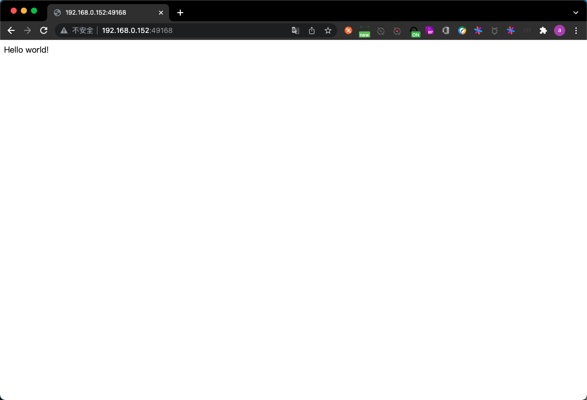
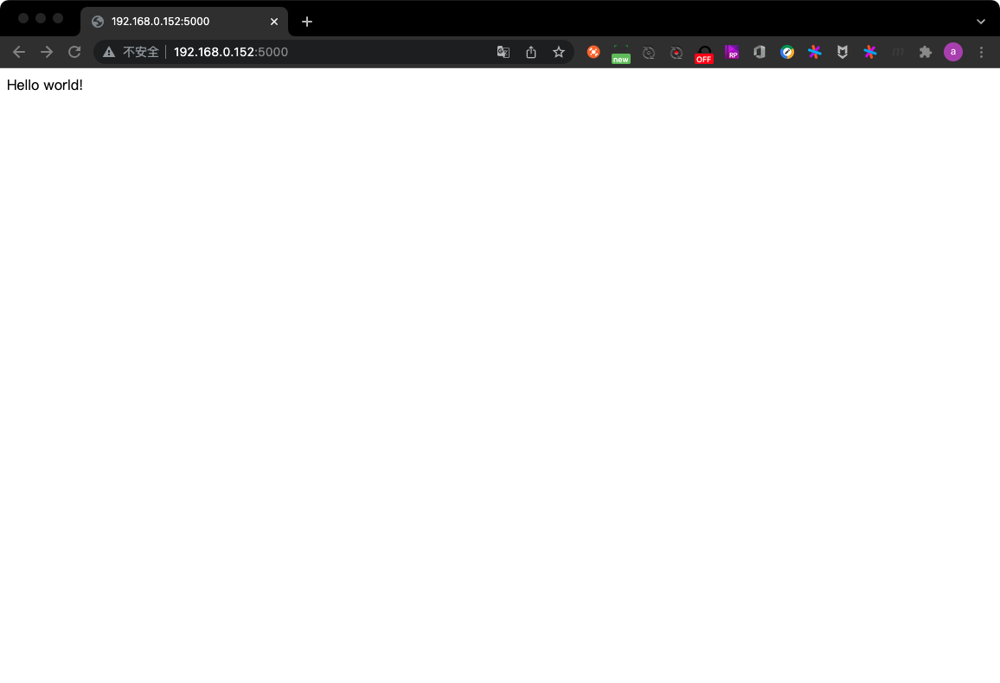

# 第7章 端口映射与容器互连

## 7.1 端口映射实现容器访问

##### 1. 从外部访问容器应用

启动容器时(通常是`docker run`),如果不指定对应参数,在容器外部是无法通过网络来访问容器内的网络应用和服务的.

当容器中运行的是一些网络应用,需要让外部访问这些应用时,可通过`-P`或`-p 宿主机端口:容器端口`来指定端口映射.

`-P`:随机映射宿主机的49000-49900的端口到内部容器开放的网络端口

例:运行一个网络服务的容器,并随机映射一个宿主机端口到容器

- step1. 运行容器并随机映射端口

```
root@docker-test:/home/roach# docker run -d -P training/webapp python app.py
6839a3d77c2ce3f7b1783a663a122b32f231085bca50c7cd1700c91b9ef0db39
```

-step2. 查看容器运行情况

```
root@docker-test:/home/roach# docker ps -l
CONTAINER ID   IMAGE             COMMAND           CREATED         STATUS         PORTS                                         NAMES
6839a3d77c2c   training/webapp   "python app.py"   5 seconds ago   Up 4 seconds   0.0.0.0:49168->5000/tcp, :::49168->5000/tcp   elated_cohen
```

- step3. 访问服务



- step4. 查看应用的日志信息

```
root@docker-test:/home/roach# docker logs 6839a3d77c2c
 * Running on http://0.0.0.0:5000/ (Press CTRL+C to quit)
192.168.0.101 - - [16/Jan/2022 07:43:55] "GET / HTTP/1.1" 200 -
192.168.0.101 - - [16/Jan/2022 07:43:55] "GET /favicon.ico HTTP/1.1" 404 -
```

`-p`:指定宿主机的端口到容器的端口.宿主机的1个指定端口,只能绑定1个容器.该参数支持的格式为:`IP:HostPort:ContainerPort`或`IP::ContainerPort`或`HostPort:ContainerPort`

##### 2. 映射所有接口地址

例:使用`HostPort:ContainerPort`的格式,将宿主机的5000端口映射到容器的5000端口上

- step1. 运行容器,指定端口映射

```
root@docker-test:/home/roach# docker run -d -p 5000:5000 training/webapp python app.py
8ea74f32b23aa54eb2098850d30ad82aafcb5f67593f602726a813a7795f1a01
```

- step2. 查看容器运行情况

```
root@docker-test:/home/roach# docker ps -l
CONTAINER ID   IMAGE             COMMAND           CREATED         STATUS         PORTS                                       NAMES
8ea74f32b23a   training/webapp   "python app.py"   5 seconds ago   Up 4 seconds   0.0.0.0:5000->5000/tcp, :::5000->5000/tcp   lucid_chatterjee
```



##### 3. 映射到指定地址的指定端口

例:使用`IP:HostPort:ContainerPort`的格式,在宿主机上指定127.0.0.1的5000端口(实际上指定的还是服务器的5000端口)映射到容器的5000端口上.

- step1. 运行容器,指定端口映射

```
root@docker-test:/home/roach# docker run -d -p 127.0.0.1:5000:5000 training/webapp python app.py
c7f7b8430d4d2f27b1da602003daa17e351a229ff0b30948e1e36f7923ca7c32
```

- step2. 查看容器运行情况

```
root@docker-test:/home/roach# docker ps
CONTAINER ID   IMAGE             COMMAND           CREATED          STATUS          PORTS                      NAMES
c7f7b8430d4d   training/webapp   "python app.py"   37 seconds ago   Up 36 seconds   127.0.0.1:5000->5000/tcp   tender_feistel
```

- step3. 访问

```
root@docker-test:/home/roach# curl localhost:5000
Hello world!
```

##### 4. 映射到指定地址的任意端口

例:使用`IP::ContainerPort`的格式,绑定服务器的任意端口到容器的5000端口(此时服务器是随机分配一个端口)

- step1. 运行容器,指定端口映射

```
root@docker-test:/home/roach# docker run -d -p 127.0.0.1::5000 training/webapp python app.py
bafb5551393e976422626aae419659ae699cc62ed4862ceb228dee581da43293
```

- step2. 查看容器运行情况

```
root@docker-test:/home/roach# docker ps -l
CONTAINER ID   IMAGE             COMMAND           CREATED         STATUS         PORTS                       NAMES
bafb5551393e   training/webapp   "python app.py"   4 seconds ago   Up 3 seconds   127.0.0.1:49153->5000/tcp   sweet_euler
```

- step3. 访问

```
root@docker-test:/home/roach# curl localhost:49153
Hello world!
```

还可以使用udp标记来指定udp端口

- step1. 运行容器,指定udp端口映射

```
root@docker-test:/home/roach# docker run -d -p 127.0.0.1:5000:5000/udp training/webapp python app.py
0765744827b4c97ac6079e4db8ab2025470fccfbbd9ee72a168790e1c88b78db
```

- step2. 查看容器运行情况

```
root@docker-test:/home/roach# docker ps -l
CONTAINER ID   IMAGE             COMMAND           CREATED         STATUS         PORTS                                NAMES
0765744827b4   training/webapp   "python app.py"   3 minutes ago   Up 3 minutes   5000/tcp, 127.0.0.1:5000->5000/udp   sharp_mayer
```

TODO:此处我不知道该如何接收一个来自UDP端口的包,所以无法测试.

##### 5. 查看映射端口配置

`docker port`:查看当前映射的端口配置

`docker port CONTAINER`:列出指定容器的所有端口映射

```
root@docker-test:/home/roach# docker port 2b84e9067254
5000/tcp -> 0.0.0.0:5000
5000/tcp -> :::5000
```

`docker port CONTAINER PRIVATE_PORT`:列出指定容器的指定端口的映射

```
root@docker-test:/home/roach# docker port 2b84e9067254 5000
0.0.0.0:5000
:::5000
```

`docker port CONTAINER PRIVATE_PORT/PROTO`:列出指定容器的指定端口和协议的映射

```
root@docker-test:/home/roach# docker port 2b84e9067254 5000/tcp
0.0.0.0:5000
:::5000
```

`docker [container] inspect CONTAINER`:获取容器的具体信息

```
root@docker-test:/home/roach# docker container inspect 2b84e9067254
[
    {
        "Id": "2b84e9067254e4ee5ab1f9fad3fc3c3db5819598d35926394c18f533c4f49f29",
        "Created": "2022-01-16T15:41:44.573294185Z",
        "Path": "python",
        "Args": [
            "app.py"
        ],
        "State": {
            "Status": "running",
            "Running": true,
            "Paused": false,
            "Restarting": false,
            "OOMKilled": false,
            "Dead": false,
            "Pid": 15016,
            "ExitCode": 0,
            "Error": "",
            "StartedAt": "2022-01-16T15:41:44.906246085Z",
            "FinishedAt": "0001-01-01T00:00:00Z"
        },
        "Image": "sha256:6fae60ef344644649a39240b94d73b8ba9c67f898ede85cf8e947a887b3e6557",
        "ResolvConfPath": "/var/lib/docker/containers/2b84e9067254e4ee5ab1f9fad3fc3c3db5819598d35926394c18f533c4f49f29/resolv.conf",
        "HostnamePath": "/var/lib/docker/containers/2b84e9067254e4ee5ab1f9fad3fc3c3db5819598d35926394c18f533c4f49f29/hostname",
        "HostsPath": "/var/lib/docker/containers/2b84e9067254e4ee5ab1f9fad3fc3c3db5819598d35926394c18f533c4f49f29/hosts",
        "LogPath": "/var/lib/docker/containers/2b84e9067254e4ee5ab1f9fad3fc3c3db5819598d35926394c18f533c4f49f29/2b84e9067254e4ee5ab1f9fad3fc3c3db5819598d35926394c18f533c4f49f29-json.log",
        "Name": "/zen_rubin",
        "RestartCount": 0,
        "Driver": "overlay2",
        "Platform": "linux",
        "MountLabel": "",
        "ProcessLabel": "",
        "AppArmorProfile": "docker-default",
        "ExecIDs": null,
        "HostConfig": {
            "Binds": null,
            "ContainerIDFile": "",
            "LogConfig": {
                "Type": "json-file",
                "Config": {}
            },
            "NetworkMode": "default",
            "PortBindings": {
                "5000/tcp": [
                    {
                        "HostIp": "",
                        "HostPort": "5000"
                    }
                ]
            },
            "RestartPolicy": {
                "Name": "no",
                "MaximumRetryCount": 0
            },
            "AutoRemove": false,
            "VolumeDriver": "",
            "VolumesFrom": null,
            "CapAdd": null,
            "CapDrop": null,
            "CgroupnsMode": "host",
            "Dns": [],
            "DnsOptions": [],
            "DnsSearch": [],
            "ExtraHosts": null,
            "GroupAdd": null,
            "IpcMode": "private",
            "Cgroup": "",
            "Links": null,
            "OomScoreAdj": 0,
            "PidMode": "",
            "Privileged": false,
            "PublishAllPorts": false,
            "ReadonlyRootfs": false,
            "SecurityOpt": null,
            "UTSMode": "",
            "UsernsMode": "",
            "ShmSize": 67108864,
            "Runtime": "runc",
            "ConsoleSize": [
                0,
                0
            ],
            "Isolation": "",
            "CpuShares": 0,
            "Memory": 0,
            "NanoCpus": 0,
            "CgroupParent": "",
            "BlkioWeight": 0,
            "BlkioWeightDevice": [],
            "BlkioDeviceReadBps": null,
            "BlkioDeviceWriteBps": null,
            "BlkioDeviceReadIOps": null,
            "BlkioDeviceWriteIOps": null,
            "CpuPeriod": 0,
            "CpuQuota": 0,
            "CpuRealtimePeriod": 0,
            "CpuRealtimeRuntime": 0,
            "CpusetCpus": "",
            "CpusetMems": "",
            "Devices": [],
            "DeviceCgroupRules": null,
            "DeviceRequests": null,
            "KernelMemory": 0,
            "KernelMemoryTCP": 0,
            "MemoryReservation": 0,
            "MemorySwap": 0,
            "MemorySwappiness": null,
            "OomKillDisable": false,
            "PidsLimit": null,
            "Ulimits": null,
            "CpuCount": 0,
            "CpuPercent": 0,
            "IOMaximumIOps": 0,
            "IOMaximumBandwidth": 0,
            "MaskedPaths": [
                "/proc/asound",
                "/proc/acpi",
                "/proc/kcore",
                "/proc/keys",
                "/proc/latency_stats",
                "/proc/timer_list",
                "/proc/timer_stats",
                "/proc/sched_debug",
                "/proc/scsi",
                "/sys/firmware"
            ],
            "ReadonlyPaths": [
                "/proc/bus",
                "/proc/fs",
                "/proc/irq",
                "/proc/sys",
                "/proc/sysrq-trigger"
            ]
        },
        "GraphDriver": {
            "Data": {
                "LowerDir": "/var/lib/docker/overlay2/299d4e63e79625d949bc3a30db15e132ea31018440e87bb75552a4e39c5dd6f1-init/diff:/var/lib/docker/overlay2/06bca82f2bb6eca50a67c06fadb8e24b536631baaca6d379a3b48133cec743d7/diff:/var/lib/docker/overlay2/7a22dd572015484fe4a54da4b3de1013145a8955252a40821548962ef94078d8/diff:/var/lib/docker/overlay2/69f0a88a4f403dfa904de0d4993866ecbc00f56f1855b73686e2ece3d26f7d9e/diff:/var/lib/docker/overlay2/8ce0c985021e22a687d3c584cb784927b1670c0d48b215c64c49ff784f799497/diff:/var/lib/docker/overlay2/278fa1fad7f6f0a5d4230bcdd92b1937a58fe4a05fba82a0972d96b769d0cb9d/diff:/var/lib/docker/overlay2/adf78b76bc9e0a3676b2ff6c99b38b588cdcbbf6628a75eb64f8e608f063c4c6/diff:/var/lib/docker/overlay2/111beaca372c0742fbc582d421b769862226f37e992c5fdc2f7651465d435987/diff:/var/lib/docker/overlay2/e9f4f51c9ebd9b3e45811186bc3bbfb2f9a3235038a9b1270ca9d804424f8362/diff:/var/lib/docker/overlay2/f74aaa672cf67308677322c6c01ce3b08532e6da3c82c6958b8b878ce17260d2/diff:/var/lib/docker/overlay2/467119eb0a8bd5f6956467394f80af499be8c63e079170cc8d9e7575da22264e/diff:/var/lib/docker/overlay2/e685dc41454af1aab7bd9273f607d33510d8ec9af8e290a1f246f2af2f23f4f3/diff:/var/lib/docker/overlay2/4fc5cad40ee3d961bda2e1ced0d57a62a2a387839e961cd6e08b0010d95ee99b/diff:/var/lib/docker/overlay2/ab6eb0b1449c7732d66c4b3645e70e8c2c0be49c4535d37140b4145aa2533b83/diff",
                "MergedDir": "/var/lib/docker/overlay2/299d4e63e79625d949bc3a30db15e132ea31018440e87bb75552a4e39c5dd6f1/merged",
                "UpperDir": "/var/lib/docker/overlay2/299d4e63e79625d949bc3a30db15e132ea31018440e87bb75552a4e39c5dd6f1/diff",
                "WorkDir": "/var/lib/docker/overlay2/299d4e63e79625d949bc3a30db15e132ea31018440e87bb75552a4e39c5dd6f1/work"
            },
            "Name": "overlay2"
        },
        "Mounts": [],
        "Config": {
            "Hostname": "2b84e9067254",
            "Domainname": "",
            "User": "",
            "AttachStdin": false,
            "AttachStdout": false,
            "AttachStderr": false,
            "ExposedPorts": {
                "5000/tcp": {}
            },
            "Tty": false,
            "OpenStdin": false,
            "StdinOnce": false,
            "Env": [
                "PATH=/usr/local/sbin:/usr/local/bin:/usr/sbin:/usr/bin:/sbin:/bin"
            ],
            "Cmd": [
                "python",
                "app.py"
            ],
            "Image": "training/webapp",
            "Volumes": null,
            "WorkingDir": "/opt/webapp",
            "Entrypoint": null,
            "OnBuild": null,
            "Labels": {}
        },
        "NetworkSettings": {
            "Bridge": "",
            "SandboxID": "8bbd87759317e93159f56c01a97c0dca5c5ff2b2339a23fe423ff79636937a01",
            "HairpinMode": false,
            "LinkLocalIPv6Address": "",
            "LinkLocalIPv6PrefixLen": 0,
            "Ports": {
                "5000/tcp": [
                    {
                        "HostIp": "0.0.0.0",
                        "HostPort": "5000"
                    },
                    {
                        "HostIp": "::",
                        "HostPort": "5000"
                    }
                ]
            },
            "SandboxKey": "/var/run/docker/netns/8bbd87759317",
            "SecondaryIPAddresses": null,
            "SecondaryIPv6Addresses": null,
            "EndpointID": "9148e60f225bfa0d9da40ee99e7ca4a76e548ebe109678cbe43055a6bf42f8f4",
            "Gateway": "172.17.0.1",
            "GlobalIPv6Address": "",
            "GlobalIPv6PrefixLen": 0,
            "IPAddress": "172.17.0.2",
            "IPPrefixLen": 16,
            "IPv6Gateway": "",
            "MacAddress": "02:42:ac:11:00:02",
            "Networks": {
                "bridge": {
                    "IPAMConfig": null,
                    "Links": null,
                    "Aliases": null,
                    "NetworkID": "4dd6db5f733b06da1592d02105b505b5ba8c13d00aa263feacbcf87ac511fe88",
                    "EndpointID": "9148e60f225bfa0d9da40ee99e7ca4a76e548ebe109678cbe43055a6bf42f8f4",
                    "Gateway": "172.17.0.1",
                    "IPAddress": "172.17.0.2",
                    "IPPrefixLen": 16,
                    "IPv6Gateway": "",
                    "GlobalIPv6Address": "",
                    "GlobalIPv6PrefixLen": 0,
                    "MacAddress": "02:42:ac:11:00:02",
                    "DriverOpts": null
                }
            }
        }
    }
]
```

## 7.2 互联机制实现便捷互访

容器的互联(linking)是一种让多个容器中的应用进行快速交互的方式.它会在源和接收容器之间创建连接关系,接收容器可以通过容器名快速访问到源容器,无需指定IP地址.

##### 1. 自定义容器命名

当创建容器时,系统默认是会分配一个名字给容器的.但自定义容器命名有2个好处:

- 自定义的命名,好记.且有表现力.比如我们把一个Web应用容器命名为web.
- 当一个容器需要连接其他容器时,可使用容器名指定要连接的容器,方便.

- step1. 启动一个Web服务容器并将该容器命名为web

```
root@docker-test:/home/roach# docker run -d -P training/webapp python app.py
b062af95242bbd5f15904a3715300c6fb9a84b9dda8f60d5ab2a15fa1366368f
```

- step2. 查看结果

```
root@docker-test:/home/roach# docker ps -l
CONTAINER ID   IMAGE             COMMAND           CREATED         STATUS         PORTS                                         NAMES
b062af95242b   training/webapp   "python app.py"   4 seconds ago   Up 3 seconds   0.0.0.0:49169->5000/tcp, :::49169->5000/tcp   flamboyant_tesla
```

注:可使用`docker [container] inspect -f "{{.Name}}"`来查看容器名字

```
root@docker-test:/home/roach# docker inspect -f "{{.Name}}" b062af95242b
/flamboyant_tesla
```

##### 2. 容器互联

`docker run`子命令的`--link`参数可以让容器之间安全地交互.参数格式为:`--link name:alias`.其中`name`为要链接的容器的名称;`alias`为要链接的容器的别名.

例:创建一个MySQL服务的容器,再创建一个Web服务容器.创建时指定该Web服务容器链接MySQL服务的容器

- step1. 创建数据库容器并将该容器命名为`db`

```
root@docker-test:/home/roach# docker run --name db -e MYSQL_ROOT_PASSWORD=my-secret-pw -d mysql
e516220b444e9ae5980050ae231f8712c5ef91135d44fcba17b15eff58f0dcb0
```

- step2. 查看容器运行情况

```
root@docker-test:/home/roach# docker ps
CONTAINER ID   IMAGE     COMMAND                  CREATED              STATUS              PORTS                 NAMES
e516220b444e   mysql     "docker-entrypoint.s…"   About a minute ago   Up About a minute   3306/tcp, 33060/tcp   db
```

- step3. 创建Web服务容器并将该容器命名为`web`,同时将该容器连接到`db`容器

```
root@docker-test:/home/roach# docker run -d -P --name web --link db:db training/webapp python app.py
36c9194c5c2b1cbfd7e984a025697c3c586bd7e276a59cd5af20a62cca8be946
```

此时`db`容器和`web`容器建立互联关系

- step4. 查看容器的连接情况

```
root@docker-test:/home/roach# docker ps --no-trunc
CONTAINER ID                                                       IMAGE             COMMAND                         CREATED              STATUS              PORTS                                         NAMES
36c9194c5c2b1cbfd7e984a025697c3c586bd7e276a59cd5af20a62cca8be946   training/webapp   "python app.py"                 About a minute ago   Up About a minute   0.0.0.0:49171->5000/tcp, :::49171->5000/tcp   web
e516220b444e9ae5980050ae231f8712c5ef91135d44fcba17b15eff58f0dcb0   mysql             "docker-entrypoint.sh mysqld"   2 minutes ago        Up 2 minutes        3306/tcp, 33060/tcp                           db,web/db
```

可以看到容器`db`的`NAMES`有2个名字:`db,web/db`.这表示`web`容器链接到`db`容器.`web`容器将被允许访问`db`容器的信息.

注意:查看容器的连接情况使用`docker ps`命令看不到完整的`NAMES`列,需要加`--no-trunc`选项

这样做相当于在2个互联的容器之间创建了一个虚拟通道,且不需要映射它们的端口到宿主机上.可以看到我们在启动`db`容器时,并没有使用`-p`和`-P`选项.这样做可以避免暴露数据库服务端口到外部网络上.

Docker通过2种方式让容器公开连接信息:

- 更新环境变量
- 更新`/etc/hosts`文件

在容器内执行`env`命令来查看`web`容器的环境变量:

```
root@docker-test:/home/roach# docker exec web env
PATH=/usr/local/sbin:/usr/local/bin:/usr/sbin:/usr/bin:/sbin:/bin
HOSTNAME=4c12178318ca
DB_PORT=tcp://172.17.0.2:3306
DB_PORT_3306_TCP=tcp://172.17.0.2:3306
DB_PORT_3306_TCP_ADDR=172.17.0.2
DB_PORT_3306_TCP_PORT=3306
DB_PORT_3306_TCP_PROTO=tcp
DB_PORT_33060_TCP=tcp://172.17.0.2:33060
DB_PORT_33060_TCP_ADDR=172.17.0.2
DB_PORT_33060_TCP_PORT=33060
DB_PORT_33060_TCP_PROTO=tcp
DB_NAME=/web/db
DB_ENV_MYSQL_ROOT_PASSWORD=my-secret-pw
DB_ENV_GOSU_VERSION=1.12
DB_ENV_MYSQL_MAJOR=8.0
DB_ENV_MYSQL_VERSION=8.0.27-1debian10
HOME=/root
```

其中`DB_`开头的环境变量是供容器`web`连接容器`db`使用的,前缀采用大写的连接别名.

除环境变量外,还可以通过添加`host`信息到父容器(TODO:A连B那么A就是B的父容器?)的`etc/hosts`文件中.

- step1. 查看容器`db`的IP信息

```
root@docker-test:/home/roach# docker inspect --format="{{.NetworkSettings.IPAddress}}" db
172.17.0.2
```

- step2. 进入`web`容器,并查看该容器的`etc/hosts`文件

```
root@docker-test:/home/roach# docker exec -it web /bin/bash
root@4c12178318ca:/opt/webapp# cat /etc/hosts
127.0.0.1	localhost
::1	localhost ip6-localhost ip6-loopback
fe00::0	ip6-localnet
ff00::0	ip6-mcastprefix
ff02::1	ip6-allnodes
ff02::2	ip6-allrouters
172.17.0.2	db a4bdee731c62
172.17.0.3	4c12178318ca
```

注:当我进入容器`web`时,`/etc/hosts`文件中已经有容器`db`的`host`信息了.所以此处我并没有手动把容器`db`的`host`信息添加到该文件中.

- step3. 在容器`web`中测试和容器`db`的互通情况

```
root@4c12178318ca:/opt/webapp# ping db
PING db (172.17.0.2) 56(84) bytes of data.
64 bytes from db (172.17.0.2): icmp_seq=1 ttl=64 time=0.061 ms
64 bytes from db (172.17.0.2): icmp_seq=2 ttl=64 time=0.102 ms
64 bytes from db (172.17.0.2): icmp_seq=3 ttl=64 time=0.046 ms
^C
--- db ping statistics ---
3 packets transmitted, 3 received, 0% packet loss, time 2038ms
rtt min/avg/max/mdev = 0.046/0.069/0.102/0.025 ms
```