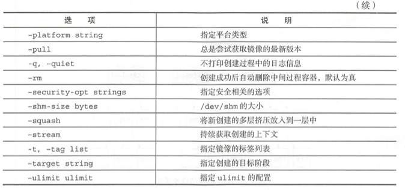

# 第8章 使用Dockerfile创建镜像

Dockerfile是一个文本格式的配置文件,用户可以使用Dockerfile来快速创建自定义的镜像.

## 8.1 基本结构

Dockerfile由一行行命令语句组成,并支持以`#`开头的注释行.

Dockerfile主体内容分为4部分:

- 基础镜像信息
- 维护者信息
- 镜像操作指令
- 容器启动时执行指令

简单示例:

```
# escape=\ (backslash)
# This dockerfile uses the ubuntu:xeniel image
# VERSION 2 - EDITION 1
# Author: docker_user
# Command format: Instruction [arguments / command] ..
# Base image to use, this must be set as the first line FROM ubuntu:xeniel

# Maintainer: docker_user <docker user@email.com> (@docker_user)
LABEL maintainer docker_user<docker_user@email.com>

# Commands to update the image
RUN echo "deb http://archive.ubuntu.com/ubuntu/ xeniel main universe" >> /etc/apt/sources.list

RUN apt-get update && apt-get install -y nginx
RUN echo "\ndaemon off;" >> /etc/nginx/nginx.conf

# Commands when creating a new container
CMD /usr/sbin/nginx
```

首行可以通过注释来指定解析器命令,后续通过注释说明镜像的相关信息.

- 主体部分首先使用`FROM`指令指明所基于的镜像名称
- 接下来一般使用`LABEL`指令说明维护者的信息
- 后面是镜像操作指令
	- 例如`RUN`指令将对镜像执行跟随的指令.每运行一条`RUN`指令,镜像都会添加新的一层并提交
- 最后是`CMD`指令,用于指定运行容器时的操作指令

Docker Hub上镜像`nginx`的Dockerfile.该镜像以`debian:bullseye-slim`为基础镜像,从而创建一个新的`nginx`镜像

```
#
# NOTE: THIS DOCKERFILE IS GENERATED VIA "update.sh"
#
# PLEASE DO NOT EDIT IT DIRECTLY.
#
FROM debian:bullseye-slim

LABEL maintainer="NGINX Docker Maintainers <docker-maint@nginx.com>"

ENV NGINX_VERSION   1.21.5
ENV NJS_VERSION     0.7.1
ENV PKG_RELEASE     1~bullseye

RUN set -x \
# create nginx user/group first, to be consistent throughout docker variants
    && addgroup --system --gid 101 nginx \
    && adduser --system --disabled-login --ingroup nginx --no-create-home --home /nonexistent --gecos "nginx user" --shell /bin/false --uid 101 nginx \
    && apt-get update \
    && apt-get install --no-install-recommends --no-install-suggests -y gnupg1 ca-certificates \
    && \
    NGINX_GPGKEY=573BFD6B3D8FBC641079A6ABABF5BD827BD9BF62; \
    found=''; \
    for server in \
        hkp://keyserver.ubuntu.com:80 \
        pgp.mit.edu \
    ; do \
        echo "Fetching GPG key $NGINX_GPGKEY from $server"; \
        apt-key adv --keyserver "$server" --keyserver-options timeout=10 --recv-keys "$NGINX_GPGKEY" && found=yes && break; \
    done; \
    test -z "$found" && echo >&2 "error: failed to fetch GPG key $NGINX_GPGKEY" && exit 1; \
    apt-get remove --purge --auto-remove -y gnupg1 && rm -rf /var/lib/apt/lists/* \
    && dpkgArch="$(dpkg --print-architecture)" \
    && nginxPackages=" \
        nginx=${NGINX_VERSION}-${PKG_RELEASE} \
        nginx-module-xslt=${NGINX_VERSION}-${PKG_RELEASE} \
        nginx-module-geoip=${NGINX_VERSION}-${PKG_RELEASE} \
        nginx-module-image-filter=${NGINX_VERSION}-${PKG_RELEASE} \
        nginx-module-njs=${NGINX_VERSION}+${NJS_VERSION}-${PKG_RELEASE} \
    " \
    && case "$dpkgArch" in \
        amd64|arm64) \
# arches officialy built by upstream
            echo "deb https://nginx.org/packages/mainline/debian/ bullseye nginx" >> /etc/apt/sources.list.d/nginx.list \
            && apt-get update \
            ;; \
        *) \
# we're on an architecture upstream doesn't officially build for
# let's build binaries from the published source packages
            echo "deb-src https://nginx.org/packages/mainline/debian/ bullseye nginx" >> /etc/apt/sources.list.d/nginx.list \
            \
# new directory for storing sources and .deb files
            && tempDir="$(mktemp -d)" \
            && chmod 777 "$tempDir" \
# (777 to ensure APT's "_apt" user can access it too)
            \
# save list of currently-installed packages so build dependencies can be cleanly removed later
            && savedAptMark="$(apt-mark showmanual)" \
            \
# build .deb files from upstream's source packages (which are verified by apt-get)
            && apt-get update \
            && apt-get build-dep -y $nginxPackages \
            && ( \
                cd "$tempDir" \
                && DEB_BUILD_OPTIONS="nocheck parallel=$(nproc)" \
                    apt-get source --compile $nginxPackages \
            ) \
# we don't remove APT lists here because they get re-downloaded and removed later
            \
# reset apt-mark's "manual" list so that "purge --auto-remove" will remove all build dependencies
# (which is done after we install the built packages so we don't have to redownload any overlapping dependencies)
            && apt-mark showmanual | xargs apt-mark auto > /dev/null \
            && { [ -z "$savedAptMark" ] || apt-mark manual $savedAptMark; } \
            \
# create a temporary local APT repo to install from (so that dependency resolution can be handled by APT, as it should be)
            && ls -lAFh "$tempDir" \
            && ( cd "$tempDir" && dpkg-scanpackages . > Packages ) \
            && grep '^Package: ' "$tempDir/Packages" \
            && echo "deb [ trusted=yes ] file://$tempDir ./" > /etc/apt/sources.list.d/temp.list \
# work around the following APT issue by using "Acquire::GzipIndexes=false" (overriding "/etc/apt/apt.conf.d/docker-gzip-indexes")
#   Could not open file /var/lib/apt/lists/partial/_tmp_tmp.ODWljpQfkE_._Packages - open (13: Permission denied)
#   ...
#   E: Failed to fetch store:/var/lib/apt/lists/partial/_tmp_tmp.ODWljpQfkE_._Packages  Could not open file /var/lib/apt/lists/partial/_tmp_tmp.ODWljpQfkE_._Packages - open (13: Permission denied)
            && apt-get -o Acquire::GzipIndexes=false update \
            ;; \
    esac \
    \
    && apt-get install --no-install-recommends --no-install-suggests -y \
                        $nginxPackages \
                        gettext-base \
                        curl \
    && apt-get remove --purge --auto-remove -y && rm -rf /var/lib/apt/lists/* /etc/apt/sources.list.d/nginx.list \
    \
# if we have leftovers from building, let's purge them (including extra, unnecessary build deps)
    && if [ -n "$tempDir" ]; then \
        apt-get purge -y --auto-remove \
        && rm -rf "$tempDir" /etc/apt/sources.list.d/temp.list; \
    fi \
# forward request and error logs to docker log collector
    && ln -sf /dev/stdout /var/log/nginx/access.log \
    && ln -sf /dev/stderr /var/log/nginx/error.log \
# create a docker-entrypoint.d directory
    && mkdir /docker-entrypoint.d

COPY docker-entrypoint.sh /
COPY 10-listen-on-ipv6-by-default.sh /docker-entrypoint.d
COPY 20-envsubst-on-templates.sh /docker-entrypoint.d
COPY 30-tune-worker-processes.sh /docker-entrypoint.d
ENTRYPOINT ["/docker-entrypoint.sh"]

EXPOSE 80

STOPSIGNAL SIGQUIT

CMD ["nginx", "-g", "daemon off;"]
```

Docker Hub上镜像`golang`的Dockerfile.该镜像是GO语言运行环境的镜像,基于镜像`buildpack-deps:bullseye-scm`制作.

```
#
# NOTE: THIS DOCKERFILE IS GENERATED VIA "apply-templates.sh"
#
# PLEASE DO NOT EDIT IT DIRECTLY.
#

FROM buildpack-deps:bullseye-scm

# install cgo-related dependencies
RUN set -eux; \
	apt-get update; \
	apt-get install -y --no-install-recommends \
		g++ \
		gcc \
		libc6-dev \
		make \
		pkg-config \
	; \
	rm -rf /var/lib/apt/lists/*

ENV PATH /usr/local/go/bin:$PATH

ENV GOLANG_VERSION 1.17.6

RUN set -eux; \
	arch="$(dpkg --print-architecture)"; arch="${arch##*-}"; \
	url=; \
	case "$arch" in \
		'amd64') \
			url='https://dl.google.com/go/go1.17.6.linux-amd64.tar.gz'; \
			sha256='231654bbf2dab3d86c1619ce799e77b03d96f9b50770297c8f4dff8836fc8ca2'; \
			;; \
		'armel') \
			export GOARCH='arm' GOARM='5' GOOS='linux'; \
			;; \
		'armhf') \
			url='https://dl.google.com/go/go1.17.6.linux-armv6l.tar.gz'; \
			sha256='9ac723e6b41cb7c3651099a09332a8a778b69aa63a5e6baaa47caf0d818e2d6d'; \
			;; \
		'arm64') \
			url='https://dl.google.com/go/go1.17.6.linux-arm64.tar.gz'; \
			sha256='82c1a033cce9bc1b47073fd6285233133040f0378439f3c4659fe77cc534622a'; \
			;; \
		'i386') \
			url='https://dl.google.com/go/go1.17.6.linux-386.tar.gz'; \
			sha256='06c50fb0d44bb03dd4ea8795f9448379c5825d2765307b51f66905084c3ba541'; \
			;; \
		'mips64el') \
			export GOARCH='mips64le' GOOS='linux'; \
			;; \
		'ppc64el') \
			url='https://dl.google.com/go/go1.17.6.linux-ppc64le.tar.gz'; \
			sha256='adc35c920b8c0253d4dd001f8979e0db4c6111a60cd5e0785a8bee95dba1fcaa'; \
			;; \
		's390x') \
			url='https://dl.google.com/go/go1.17.6.linux-s390x.tar.gz'; \
			sha256='ccb2d4509db846be7055d1105b28154e72cd43162c4ef79c38a936a3e6f26e1d'; \
			;; \
		*) echo >&2 "error: unsupported architecture '$arch' (likely packaging update needed)"; exit 1 ;; \
	esac; \
	build=; \
	if [ -z "$url" ]; then \
# https://github.com/golang/go/issues/38536#issuecomment-616897960
		build=1; \
		url='https://dl.google.com/go/go1.17.6.src.tar.gz'; \
		sha256='4dc1bbf3ff61f0c1ff2b19355e6d88151a70126268a47c761477686ef94748c8'; \
		echo >&2; \
		echo >&2 "warning: current architecture ($arch) does not have a compatible Go binary release; will be building from source"; \
		echo >&2; \
	fi; \
	\
	wget -O go.tgz.asc "$url.asc"; \
	wget -O go.tgz "$url" --progress=dot:giga; \
	echo "$sha256 *go.tgz" | sha256sum -c -; \
	\
# https://github.com/golang/go/issues/14739#issuecomment-324767697
	GNUPGHOME="$(mktemp -d)"; export GNUPGHOME; \
# https://www.google.com/linuxrepositories/
	gpg --batch --keyserver keyserver.ubuntu.com --recv-keys 'EB4C 1BFD 4F04 2F6D DDCC  EC91 7721 F63B D38B 4796'; \
# let's also fetch the specific subkey of that key explicitly that we expect "go.tgz.asc" to be signed by, just to make sure we definitely have it
	gpg --batch --keyserver keyserver.ubuntu.com --recv-keys '2F52 8D36 D67B 69ED F998  D857 78BD 6547 3CB3 BD13'; \
	gpg --batch --verify go.tgz.asc go.tgz; \
	gpgconf --kill all; \
	rm -rf "$GNUPGHOME" go.tgz.asc; \
	\
	tar -C /usr/local -xzf go.tgz; \
	rm go.tgz; \
	\
	if [ -n "$build" ]; then \
		savedAptMark="$(apt-mark showmanual)"; \
		apt-get update; \
		apt-get install -y --no-install-recommends golang-go; \
		\
		( \
			cd /usr/local/go/src; \
# set GOROOT_BOOTSTRAP + GOHOST* such that we can build Go successfully
			export GOROOT_BOOTSTRAP="$(go env GOROOT)" GOHOSTOS="$GOOS" GOHOSTARCH="$GOARCH"; \
			./make.bash; \
		); \
		\
		apt-mark auto '.*' > /dev/null; \
		apt-mark manual $savedAptMark > /dev/null; \
		apt-get purge -y --auto-remove -o APT::AutoRemove::RecommendsImportant=false; \
		rm -rf /var/lib/apt/lists/*; \
		\
# pre-compile the standard library, just like the official binary release tarballs do
		go install std; \
# go install: -race is only supported on linux/amd64, linux/ppc64le, linux/arm64, freebsd/amd64, netbsd/amd64, darwin/amd64 and windows/amd64
#		go install -race std; \
		\
# remove a few intermediate / bootstrapping files the official binary release tarballs do not contain
		rm -rf \
			/usr/local/go/pkg/*/cmd \
			/usr/local/go/pkg/bootstrap \
			/usr/local/go/pkg/obj \
			/usr/local/go/pkg/tool/*/api \
			/usr/local/go/pkg/tool/*/go_bootstrap \
			/usr/local/go/src/cmd/dist/dist \
		; \
	fi; \
	\
	go version

ENV GOPATH /go
ENV PATH $GOPATH/bin:$PATH
RUN mkdir -p "$GOPATH/src" "$GOPATH/bin" && chmod -R 777 "$GOPATH"
WORKDIR $GOPATH
```

## 8.2 指令说明

Dockerfile中指令的一般格式为`INSTRUCTION arguments`,根据功能可以划分为2大类指令:

- 配置指令:用于配置镜像信息
- 操作指令:具体执行操作

配置指令:

|指令|说明|
|:-:|:-:|
|ARG|定义创建镜像过程中使用的变量|
|FROM|指定所创建镜像的基础镜像|
|LABEL|为生成的镜像添加元数据标签信息|
|ENV|指定环境变量|
|ENTRYPOINT|指定镜像的默认入口命令|
|VOLUME|创建一个数据挂载点|
|USER|指定运行容器时的用户名或UID|
|WORKDIR|配置工作目录|
|ONBUILD|创建子镜像时指定自动执行的操作指令|
|STOPSINGAL|指定退出的信号值|
|HEALTHCHECK|配置所启动的容器如何进行健康检查|
|SHELL|指定默认shell类型|

操作指令:

|指令|说明|
|:-:|:-:|
|RUN|运行指定命令|
|CMD|启动容器时指定默认执行的命令|
|ADD|添加内容到镜像|
|COPY|复制内容到镜像|

### 8.2.1 配置指令

##### 1. ARG

`ARG`:定义创建镜像过程中使用的变量

格式:`ARG <name> [=<default value>]`

在执行`docker build`时,可通过`-build-arg[=]`来为变量赋值.当镜像编译成功后,`ARG`指定的变量就不存在了(`ENV`指定的变量将在镜像中保留).

Docker内置了一些镜像创建变量,用户可直接使用这些变量,无需声明.包括:

- `HTTP-PROXY`
- `HTTPS-PROXY`
- `FTP-PROXY`
- `NO-PROXY`

例:`ARG VERSION=0.1`

注意:不建议使用构建时变量来传递诸如`github`密钥,用户凭据等机密.构建时变量值对于使用`docker history`命令的镜像的任何用户都是可见的

##### 2. FROM

指定所创建镜像的基础镜像

格式:`FROM <image> [AS <name>]`或`FROM <image>:<tag> [AS <name>]`或`FROM <image>@<digest> [AS <name>]`

任何Dockerfile中第1条指令必须为`FROM`指令.但如果在1个Dockerfile中构建多个镜像时,可以使用多个`FROM`指令(每个镜像1次).

注意:为了保证镜像精简,可以选用体积较小的镜像,如`Alpline`或`Debian`作为基础镜像.

例:`FROM debian:9.3`

##### 3. LABEL

为生成的镜像添加元数据标签信息.这些信息可以用于辅助过滤出特定的镜像

格式:`LABEL <key>=<value> <key>=<value> <key>=<value> ...`

例:

```
LABEL version="10.0.-rc3"
LABEL author="user@github" date="2022-01-15"
LABEL description="This text illustrates \
	that label-values can span multiple lines."
```

##### 4. EXPOSE

声明镜像内服务监听的端口

格式:`EXPOSE <port> [<port>/<protocol> ...]`

例:`EXPOST 22 80 8443`

**注意:该指令只是起到声明作用,并不会自动完成端口映射**

##### 5. ENV

指定环境变量,在镜像生成的过程中,会被后续`RUN`指令使用,这些环境变量在镜像启动的容器中也会存在.

格式:`ENV <key> <value>`或`ENV <key>=<value>`

例:

```
ENV APP_VERSION=1.0.0
ENV APP_HOME=/usr/local/app
ENV PATH $PATH:/usr/local/bin
```

##### 6. ENTRYPOINT

指定镜像的默认入口命令,该入口命令会在启动容器时作为根命令执行,所有传入值作为该命令的参数.

格式:

- `ENTRYPOINT ["executable", "param1", "param2"]`:使用`exec`执行,推荐这种方式
- `ENTRYPOINT command param1 param2`:在`shell`中执行,通常当需要交互时使用

此时,`CMD`指令指定值将作为根命令的参数.

每个Dockerfile中只能有1个`ENTRYPOINT`,当指定多个时,只有最后一个生效.

在运行容器时,可以被`--entrypoint`参数覆盖掉.格式:`docker run --entrypoint="command"`

##### 7. VOLUME

创建一个数据卷挂载点

格式:`VOLUME ["/data"]`

运行容器时可以从本地主机或其他容器挂载数据卷,通常用于存放数据库和需要持久化的数据.

##### 8. USER

指定容器运行时的用户名或UID,后续的`RUN`指令也会使用该指令指定的用户身份.

格式:`USER daemon`

当服务不需root权限时,可通过该命令指定运行用户,并且可以在Dockerfile中创建所需用户.

例:`RUN groupadd -r postgres && useradd --no-log-init -r -g postgres postgres`

##### 9. WORKDIR

为后续的`RUN`、`CMD`、`ENTRYPOINT`指令配置工作目录.

格式:`WORKDIR /path/to/workdir`

可以使用多个`WORKDIR`指令,后续命令如果参数是相对路径,则会基于之前的命令,继续指定路径.

例:

```
WORKDIR /a
WORKDIR b
WORKDIR c
RUN pwd
```

则最终路径为:`/a/b/c`.

**为了避免出错,推荐`WORKDIR`指令中只使用绝对路径.**

##### 10. ONBUILD

指定当基于所生成的镜像创建子镜像时,自动执行的操作指令.

格式:`ONBUILD [INSTRUCTION]`

例:

父镜像的Dockerfile

```
# Dockerfile for ParentImage
[...]
ONBUILD ADD . /app/src
ONBUILD RUN /usr/local/bin/python-build --dir /app/src
[...]
```

使用`docker build`命令创建子镜像`ChildImage`时(也就是子镜像的Dockerfile的第1行为`FROM ParentImage`),会首先执行`ParentImage`中配置的`ONBUILD`指令.

也就是父镜像中的`ONBUILD`指令,等价与在`ChildImage`的Dockerfile中添加了如下指令:

```
#Automatically run the following when building ChildImage
ADD . /app/src
RUN /usr/local/bin/python-build --dir /app/src
...
```

由于`ONBUILD`指令是隐式执行的,推荐在使用它的镜像标签中进行标注,例如:`ruby:2.1-onbuild`.

`ONBUILD`指令在创建专门用于自动编译、检查等操作的基础镜像时,十分有用.

##### 11. STOPSIGNAL

对基于所构建镜像启动的容器,指定接收退出的信号值

格式:`STOPSIGNAL signal`

##### 12. HEALTHCHECK

配置基于所构建的镜像启动的容器,如何进行健康检查(比如如何判断是否健康).

格式:

- `HEALTHCHECK [OPTIONS] CMD command`:根据所执行命令返回值是否为0来判断.
	- `OPTION`支持的参数:
	- `-interval=DURATION`(default: 30s):每过多久检查1次
	- `-timeout=DURATION`(default: 30s):每次检查等待结果的超时
	- `-retries=N`(default: 3):重试次数.当检查检查失败时会重试,超过该选项设定的次数后,即判定为失败
- `HEALTHCHECK NONE`:禁止基础镜像中的健康检查

##### 13. SHELL

指定其他命令使用shell时,默认的shell类型

格式:`SHELL["executable", "parameters"]`

默认值为:`["/bin/sh", "-c"]`

### 8.2.2 操作指令

##### 1. RUN

运行指定指令

格式:

- `RUN <command>`:默认将在shell终端中运行命令,即`/bin/sh -c`
- `RUN ["executable", "param1", "param2"]`:这种格式的指令会被解析为JSON数组,因此必须用`""`包裹内容.这种格式使用`exec`执行,不会启动shell环境

若要使用其他终端类型,则可以使用`RUN ["executable", "param1", "param2"]`的格式.

例:`RUN ["/bin/bash", "-c", "echo hello"]`

每条`RUN`指令将在当前镜像基础上执行指定命令,并提交为新的镜像层.当命令较长时,可使用`\`来换行.

例:

```
RUN apt-get update \
	&& apt-get install -y libsnappy-dev zliblg-dev libbz2-dev \
	&& rm -rf /var/cache/apt \
	&& rm -rf /var/lib/apt/lists/*
```

##### 2. CMD

用于指定启动容器时默认执行的命令

格式:

- `CMD ["executable", "param1", "param2"]`:相当于执行`executable param1 param2`.推荐方式
- `CMD command param1 param2`:在默认的Shell中执行,提供给需要交互的应用
- `CMD ["param1", "param2"]`:提供给`ENTRYPOINT`指令的默认参数.

每个Dockerfile只能有一条`CMD`指令.如果指定了多条`CMD`指令则只有最后一条会被执行.

如果用户启动容器时候手动指定了运行的命令(以`docker run`命令的参数的形式指定),则会覆盖掉`CMD`指定的命令.

##### 3. ADD

添加内容到镜像

格式:`ADD <src> <dest>`

该命令将复制指定的`<src>`路径下的内容到容器中的`<dest>`的路径下

其中`<src>`可以为:

- Dockerfile所在目录的相对路径(文件或目录均可)
- 一个URL
- 一个`tar`文件(在镜像中会自动解压为镜像中的目录

`<dest>`可以为:

- 镜像内的绝对路径
- 相对工作目录(WORKDIR)的相对路径

例:`ADD *.c /code/`

##### 4. COPY

复制内容到镜像

格式:`COPY <src> <dest>`

该命令将复制本地主机`<src>`下的内容到镜像中的`<dest>`.`<dest>`不存在时将自动创建.

其中`<src>`可以为:

- Dockerfile所在目录的相对路径
- 文件
- 目录

路径同样支持正则格式

`COPY`与`ADD`指令功能类似,当使用本地目录为源目录时,推荐使用`COPY`

例:`COPY /www/* /www/`

## 8.3 创建镜像

编写完成Dockerfile后,可通过`docker [image] build`命令来创建镜像.

格式:`docker build [OPTIONS] PATH | URL | -`

该命令将读取指定路径下(包括子目录)的Dockerfile,并将该路径下所有数据作为上下文(Context)发送给Docker服务端.Docker服务端在校验Dockerfile格式通过后,逐条执行其中定义的指令,碰到`ADD`、`COPY`、`RUN`指令则会生成一层新的镜像.最终如果创建镜像成功,会返回最终镜像的ID.

**如果上下文过大,会导致发送大量数据给服务端,延缓创建过程.因此除非是生成镜像所必需的文件,不然不要放到上下文路径下.**

比较常用的选项:

- `-f`:指定Dockerfile所在的路径
- `-t`:指定构建出来的镜像的名字和标签

例:Dockerfile所在路径为`/tmp/docker_builder/`,Dockerfile文件名为`Dockerfile1`,要求构建的镜像标签为`builder/first_image:1.0.0`

```
docker build -t builder/first_image:1.0.0 -f /tmp/docker_builder/Dockerfile1 .
```

### 8.3.1 命令选项




### 8.3.2 选择父镜像

通常,构建新的镜像都需要通过`FROM`指令来指定父镜像.父镜像是生成镜像的基础,会直接影响到所生成镜像的大小和功能.

通常可供选择的父镜像有2种:

- 基础镜像(base image)
	- 这种镜像的Dockerfile中通常不存在`FROM`指令,或者是基于`scratch`镜像(`FROM scratch`).这意味着其在整个镜像树中处于根的位置
- 普通镜像
	- 通常由第三方创建,基于基础镜像创建

例:一个简单的基础镜像,将用户提前编译好的二进制文件`binary`复制到镜像中,运行容器时执行`binary`命令:

```
FROM scratch
ADD binary /
CMD ["/binary"]
```

普通镜像也可以作为父镜像来使用,包括常见的busybox、debian、ubuntu等.


### 8.3.3 使用.dockerignore文件

使用`.dockerignore`文件(每1行添加1条匹配模式),可以让Docker忽略匹配到的路径或文件,在构建镜像时,不要把无关数据发送到服务端.

例:

```
# .dockerignore 文件中可以定义的忽略模式
*/temp*
*/*/temp*
tmp?
~*
Dockerfile
!README.md
```

### 8.3.4 多步骤创建

Multi-stage build:多步骤镜像创建特性,可以精简最终生成的镜像大小.

对于需要编译的应用(比如C、GO、JAVA等),通常需要准备2个Docker镜像:

- 编译环境镜像:包括完整的编译引擎、依赖库等,往往比较庞大.该镜像的作用是编译应用为二进制文件
- 运行环境镜像:利用编译好的二进制文件,运行引用,由于不需要编译环境,体积较小.

**使用多步骤创建,可以在保证最终生成的运行环境镜像保持精简的情况下,使用单一的Dockerfile,降低维护的复杂度.**

以GO语言应用为例:

- step1. 创建`main.go`文件,写入GO代码

```
root@docker-test:/home/roach/dockerGoImg# pwd
/home/roach/dockerGoImg
root@docker-test:/home/roach/dockerGoImg# ls
main.go
root@docker-test:/home/roach/dockerGoImg# cat main.go 
package main

import "fmt"

func main() {
    fmt.Println("Hello Docker")
}
```

- step2. 创建Dockerfile,以`golang:1.17.6`为基础镜像,编译GO语言代码为二进制文件app,使用精简镜像`alpine:latest`作为运行环境

```
root@docker-test:/home/roach/dockerGoImg# vim Dockerfile
root@docker-test:/home/roach/dockerGoImg# cat Dockerfile 
# 编译用镜像
ARG GO_VERSION=1.17.6
# 命名编译用镜像为builder
FROM golang:${GO_VERSION} as builder
RUN mkdir -p /go/src/test
WORKDIR /go/src/test
COPY main.go .
RUN go mod init testGoProject
RUN CGO_ENABLED=0 GOOS=linux go build -o app .

# 运行用镜像
FROM alpine:latest
RUN apk --no-cache add ca-certificates
WORKDIR /root/
# 从镜像builder处复制文件
COPY --from=builder /go/src/test/app .
CMD ["./app"]
```

- step3. 构建镜像

```
root@docker-test:/home/roach/dockerGoImg# docker build -t 40486453/test-multistage:latest -f ./Dockerfile .
Sending build context to Docker daemon  3.072kB
Step 1/12 : ARG GO_VERSION=1.17.6
Step 2/12 : FROM golang:${GO_VERSION} as builder
 ---> 8b86bf336a01
Step 3/12 : RUN mkdir -p /go/src/test
 ---> Using cache
 ---> 9b848b42c8c7
Step 4/12 : WORKDIR /go/src/test
 ---> Using cache
 ---> 522c596093ef
Step 5/12 : COPY main.go .
 ---> Using cache
 ---> 1c1443457c02
Step 6/12 : RUN go mod init testGoProject
 ---> Using cache
 ---> 16dd5e1ac0e1
Step 7/12 : RUN CGO_ENABLED=0 GOOS=linux go build -o app .
 ---> Using cache
 ---> ce12f020af7e
Step 8/12 : FROM alpine:latest
 ---> c059bfaa849c
Step 9/12 : RUN apk --no-cache add ca-certificates
 ---> Using cache
 ---> 2ac32ce0447c
Step 10/12 : WORKDIR /root/
 ---> Using cache
 ---> 76d62b6b50bf
Step 11/12 : COPY --from=builder /go/src/test/app .
 ---> 71518cc5a023
Step 12/12 : CMD ["./app"]
 ---> Running in 254c658cca09
Removing intermediate container 254c658cca09
 ---> 138c7fdfc0a1
Successfully built 138c7fdfc0a1
Successfully tagged 40486453/test-multistage:latest
```

- step4. 基于镜像运行容器

```
root@docker-test:/home/roach/dockerGoImg# docker run --rm 40486453/test-multistage:latest
Hello Docker
```

- step5. 查看镜像大小

```
root@docker-test:/home/roach/dockerGoImg# docker images|grep 40486453/test-multistage
40486453/test-multistage   latest         138c7fdfc0a1   2 minutes ago   7.85MB
```

### 8.3.5 最佳实践

- 精简镜像用途:尽量让每个镜像的用途都比较集中单一,避免构造大而复杂、多功能的镜像
- 选用合适的基础镜像:容器的核心是应用.选用过大的父镜像(如Ubuntu系统镜像)会造成最终生成的应用镜像很臃肿,推荐选用瘦身过的应用镜像(比如node:slim)或较为小巧的系统镜像(alpine、busybox或debian)
- 提供注释和维护者信息:Dockerfile也是一种代码,需要考虑方便后续的扩展和他人的使用
- 正确使用版本号:使用明确的版本号信息,如`1.0`、`2.0`,而非依赖默认的`latest`.通过版本号可以避免环境不一致导致的问题
- 减少镜像层数:如果所希望生成镜像的层数尽量少,则要尽量合并`RUN`、`ADD`、`COPY`指令.通常情况下,多个`RUN`指令可以合并为1条`RUN`指令
- 恰当使用多步骤创建:通过多步骤创建,可以将编译和运行等过程分开,保证最终生成的镜像只包括运行应用所需的最小化环境.也可以通过分别构造编译镜像和运行镜像来达到类似的结果.但这种方式需要维护多个Dockerfile.不推荐
- 使用.dockerignore文件:使用它可以标记在执行`docker build`时忽略的路径和文件,避免发送不必要的数据内容,从而加快整个镜像创建过程
- 及时删除临时文件和缓存文件:在执行`apt-get`指令后,`/var/cache/ apt`下面会缓存了一些安装包
- 提高构建速度:合理使用cache,减少内容目录下的文件,或使用`.dockerignore`文件指定
- 调整合理的指令顺序:在开启cache的情况下,内容不变的指令尽量放在前面,这样可以尽量复用
- 减少外部源的干扰:如果确实要从外部引入数据,需要指定持久的地址,并带版本信息等,让他人可以复用且不出错

## 附:ENTRYPOINT和CMD指令的区别

### 1. 在Dockerfile中使用`CMD`指令

- step1. 创建Dockerfile文件

```
root@docker-test:/home/roach/testDockerfile# pwd
/home/roach/testDockerfile
root@docker-test:/home/roach/testDockerfile# cat Dockerfile1 
FROM ubuntu:18.04

CMD ["ls", "-a"]
```

- step2. 构建镜像

```
root@docker-test:/home/roach/testDockerfile# docker build -f Dockerfile1 -t my-ubuntu:1.0 .
Sending build context to Docker daemon  2.048kB
Step 1/2 : FROM ubuntu:18.04
 ---> 5a214d77f5d7
Step 2/2 : CMD ["ls", "-a"]
 ---> Running in 28d62f041a86
Removing intermediate container 28d62f041a86
 ---> 457875fdb59a
Successfully built 457875fdb59a
Successfully tagged my-ubuntu:1.0
```

- step3. 基于镜像运行容器

```
root@docker-test:/home/roach/testDockerfile# docker run my-ubuntu:1.0
.
..
.dockerenv
bin
boot
dev
etc
home
lib
lib64
media
mnt
opt
proc
root
run
sbin
srv
sys
tmp
usr
var
```

- step4. 运行容器时添加命令

```
root@docker-test:/home/roach/testDockerfile# docker run my-ubuntu:1.0 ls -l
total 64
drwxr-xr-x   2 root root 4096 Sep 30 12:34 bin
drwxr-xr-x   2 root root 4096 Apr 24  2018 boot
drwxr-xr-x   5 root root  340 Jan 17 07:59 dev
drwxr-xr-x   1 root root 4096 Jan 17 07:59 etc
drwxr-xr-x   2 root root 4096 Apr 24  2018 home
drwxr-xr-x   8 root root 4096 May 23  2017 lib
drwxr-xr-x   2 root root 4096 Sep 30 12:33 lib64
drwxr-xr-x   2 root root 4096 Sep 30 12:32 media
drwxr-xr-x   2 root root 4096 Sep 30 12:32 mnt
drwxr-xr-x   2 root root 4096 Sep 30 12:32 opt
dr-xr-xr-x 195 root root    0 Jan 17 07:59 proc
drwx------   2 root root 4096 Sep 30 12:33 root
drwxr-xr-x   5 root root 4096 Sep 30 12:34 run
drwxr-xr-x   2 root root 4096 Sep 30 12:34 sbin
drwxr-xr-x   2 root root 4096 Sep 30 12:32 srv
dr-xr-xr-x  13 root root    0 Jan 17 07:59 sys
drwxrwxrwt   2 root root 4096 Sep 30 12:34 tmp
drwxr-xr-x  10 root root 4096 Sep 30 12:32 usr
drwxr-xr-x  11 root root 4096 Sep 30 12:33 var
```

**可以看到,通过`CMD`指令添加的命令,是可以被运行镜像时指定的命令覆盖掉的**

- step5. 运行容器时添加选项

```
root@docker-test:/home/roach/testDockerfile# docker run my-ubuntu:1.0 -l
docker: Error response from daemon: OCI runtime create failed: container_linux.go:380: starting container process caused: exec: "-l": executable file not found in $PATH: unknown.
```

**可以看到,无法通过运行镜像时指定选项的方式为`CMD`指令中的命令添加选项**

### 2. 在Dockerfile中使用`ENTRYPOINT`指令

- step1. 创建Dockerfile文件

```
root@docker-test:/home/roach/testDockerfile# pwd
/home/roach/testDockerfile
root@docker-test:/home/roach/testDockerfile# cat Dockerfile2 
FROM ubuntu:18.04

ENTRYPOINT ["ls", "-a"]
```

- step2. 构建镜像

```
root@docker-test:/home/roach/testDockerfile# docker build -f Dockerfile2 -t my-ubuntu:2.0 .
Sending build context to Docker daemon  3.072kB
Step 1/2 : FROM ubuntu:18.04
 ---> 5a214d77f5d7
Step 2/2 : ENTRYPOINT ["ls", "-a"]
 ---> Running in 929334768d82
Removing intermediate container 929334768d82
 ---> 41e07c9eeab5
Successfully built 41e07c9eeab5
Successfully tagged my-ubuntu:2.0
```

- step3. 基于镜像运行容器

```
root@docker-test:/home/roach/testDockerfile# docker run my-ubuntu:2.0
.
..
.dockerenv
bin
boot
dev
etc
home
lib
lib64
media
mnt
opt
proc
root
run
sbin
srv
sys
tmp
usr
var
```

- step4. 运行容器时添加命令

```
root@docker-test:/home/roach/testDockerfile# docker run my-ubuntu:2.0 ls -l
ls: cannot access 'ls': No such file or directory
```

**可以看到,运行镜像时添加的命令,无法覆盖`ENTRYPOINT`指令中的命令**

- step5. 运行容器时添加选项

```
root@docker-test:/home/roach/testDockerfile# docker run my-ubuntu:2.0 -l
total 72
drwxr-xr-x   1 root root 4096 Jan 17 08:12 .
drwxr-xr-x   1 root root 4096 Jan 17 08:12 ..
-rwxr-xr-x   1 root root    0 Jan 17 08:12 .dockerenv
drwxr-xr-x   2 root root 4096 Sep 30 12:34 bin
drwxr-xr-x   2 root root 4096 Apr 24  2018 boot
drwxr-xr-x   5 root root  340 Jan 17 08:12 dev
drwxr-xr-x   1 root root 4096 Jan 17 08:12 etc
drwxr-xr-x   2 root root 4096 Apr 24  2018 home
drwxr-xr-x   8 root root 4096 May 23  2017 lib
drwxr-xr-x   2 root root 4096 Sep 30 12:33 lib64
drwxr-xr-x   2 root root 4096 Sep 30 12:32 media
drwxr-xr-x   2 root root 4096 Sep 30 12:32 mnt
drwxr-xr-x   2 root root 4096 Sep 30 12:32 opt
dr-xr-xr-x 196 root root    0 Jan 17 08:12 proc
drwx------   2 root root 4096 Sep 30 12:33 root
drwxr-xr-x   5 root root 4096 Sep 30 12:34 run
drwxr-xr-x   2 root root 4096 Sep 30 12:34 sbin
drwxr-xr-x   2 root root 4096 Sep 30 12:32 srv
dr-xr-xr-x  13 root root    0 Jan 17 08:12 sys
drwxrwxrwt   2 root root 4096 Sep 30 12:34 tmp
drwxr-xr-x  10 root root 4096 Sep 30 12:32 usr
drwxr-xr-x  11 root root 4096 Sep 30 12:33 var
```

**可以看到,运行镜像时添加的选项被追加到了`ENTRYPOINT`指令中的命令中(也就是说此时镜像执行的命令是`ls -al`)**

### 3. 使用`CMD`指令为`ENTRYPOINT`指令追加选项

- step1. 创建Dockerfile文件

```
root@docker-test:/home/roach/testDockerfile# pwd
/home/roach/testDockerfile
root@docker-test:/home/roach/testDockerfile# cat Dockerfile3
FROM ubuntu:18.04

ENTRYPOINT ["ls", "-a"]

CMD ["-l"]
```

- step2. 构建镜像

```
root@docker-test:/home/roach/testDockerfile# docker build -f Dockerfile3 -t my-ubuntu:3.0 .
Sending build context to Docker daemon  4.096kB
Step 1/3 : FROM ubuntu:18.04
 ---> 5a214d77f5d7
Step 2/3 : ENTRYPOINT ["ls", "-a"]
 ---> Using cache
 ---> 41e07c9eeab5
Step 3/3 : CMD ["-l"]
 ---> Running in dcea9b0547d9
Removing intermediate container dcea9b0547d9
 ---> 93b6fb6b8635
Successfully built 93b6fb6b8635
Successfully tagged my-ubuntu:3.0
```

- step3. 基于镜像运行容器

```
root@docker-test:/home/roach/testDockerfile# docker run my-ubuntu:3.0
total 72
drwxr-xr-x   1 root root 4096 Jan 17 08:17 .
drwxr-xr-x   1 root root 4096 Jan 17 08:17 ..
-rwxr-xr-x   1 root root    0 Jan 17 08:17 .dockerenv
drwxr-xr-x   2 root root 4096 Sep 30 12:34 bin
drwxr-xr-x   2 root root 4096 Apr 24  2018 boot
drwxr-xr-x   5 root root  340 Jan 17 08:17 dev
drwxr-xr-x   1 root root 4096 Jan 17 08:17 etc
drwxr-xr-x   2 root root 4096 Apr 24  2018 home
drwxr-xr-x   8 root root 4096 May 23  2017 lib
drwxr-xr-x   2 root root 4096 Sep 30 12:33 lib64
drwxr-xr-x   2 root root 4096 Sep 30 12:32 media
drwxr-xr-x   2 root root 4096 Sep 30 12:32 mnt
drwxr-xr-x   2 root root 4096 Sep 30 12:32 opt
dr-xr-xr-x 194 root root    0 Jan 17 08:17 proc
drwx------   2 root root 4096 Sep 30 12:33 root
drwxr-xr-x   5 root root 4096 Sep 30 12:34 run
drwxr-xr-x   2 root root 4096 Sep 30 12:34 sbin
drwxr-xr-x   2 root root 4096 Sep 30 12:32 srv
dr-xr-xr-x  13 root root    0 Jan 17 08:17 sys
drwxrwxrwt   2 root root 4096 Sep 30 12:34 tmp
drwxr-xr-x  10 root root 4096 Sep 30 12:32 usr
drwxr-xr-x  11 root root 4096 Sep 30 12:33 var
```

**可以看到,此时`CMD`指令追加的`-l`选项是生效的,也就是说`CMD`指令可以为`ENTRYPOINT`指令中的命令追加选项**

- step4. 运行容器时添加命令

```
root@docker-test:/home/roach/testDockerfile# docker run my-ubuntu:3.0 ls -c
ls: cannot access 'ls': No such file or directory
```

由于指定了`ENTRYPOINT`指令,因此运行容器时无法添加命令.

- step5. 运行容器时添加选项

```
root@docker-test:/home/roach/testDockerfile# docker run my-ubuntu:3.0 -c
dev
sys
proc
.
..
.dockerenv
etc
bin
boot
home
lib
lib64
media
mnt
opt
root
run
sbin
srv
tmp
usr
var
```

**依旧可以对`ENTRYPOINT`中的命令追加选项**